# Python Virtual Environment (venv)

## What is a Virtual Environment?

A **Virtual Environment** is a separate and isolated workspace for a Python project.

It creates a private copy of Python and installs packages only for that project, without affecting other Python projects or your system Python.

Think of it like this:

- Your computer = A building
- Each Python project = A separate room
- Virtual Environment = A lock on each room

Everything inside one room stays there and does not disturb the others.

---

# Why Do We Use a Virtual Environment?

Without a virtual environment, all Python packages are installed globally on your computer.

Imagine:

Project A needs:
- Django 4.2

Project B needs:
- Django 5.2

If both are installed globally, one project may stop working because the versions conflict.

A virtual environment solves this problem because each project has its own packages.

Benefits:

- Prevents package conflicts
- Keeps projects separate
- Keeps system Python clean
- Makes projects easier to share
- Allows different package versions for different projects

---

# How Does It Work?

When you create a virtual environment, Python creates a new folder.

Inside that folder are:

- A separate Python interpreter
- pip
- Installed libraries
- Configuration files

When the environment is activated:

Python uses the packages inside that environment only.

When it is deactivated:

Python returns to the normal system installation.

---

# Creating a Virtual Environment

Move to your project folder first.

```bash
cd MyProject
```

Create a virtual environment.

```bash
python -m venv venv
```

Explanation:

- `python` → Runs Python
- `-m` → Runs a Python module
- `venv` → Built-in module for creating virtual environments
- `venv` → Name of the environment folder

After running the command:

```
MyProject/
│
├── venv/
├── app.py
└── requirements.txt
```

---

# Activate the Virtual Environment

## Windows

```bash
venv\Scripts\activate
```

or

```bash
.\venv\Scripts\activate
```

After activation, your terminal becomes:

```bash
(venv) C:\Users\Sidra\MyProject>
```

The `(venv)` indicates that the virtual environment is active.

---

## macOS/Linux

```bash
source venv/bin/activate
```

---

# How to Check if It Is Activated?

Method 1

Your terminal shows:

```bash
(venv)
```

Example:

```bash
(venv) C:\Projects\FlaskApp>
```

---

Method 2

Check Python location:

Windows

```bash
where python
```

macOS/Linux

```bash
which python
```

If activated, the path will point inside the `venv` folder.

Example:

```
C:\Projects\MyApp\venv\Scripts\python.exe
```

---

Method 3

Check pip location:

```bash
pip --version
```

Output:

```
pip ... from C:\Projects\MyApp\venv\Lib\site-packages
```

If the path contains `venv`, the environment is active.

---

# Install Packages

Install a package normally.

```bash
pip install flask
```

It is installed only inside the virtual environment.

Other Python projects cannot use it unless they install it too.

---

# View Installed Packages

```bash
pip list
```

Example:

```
Flask
Werkzeug
Jinja2
click
```

---

# Save Installed Packages

Create a file containing all installed packages.

```bash
pip freeze > requirements.txt
```


This allows others to install the same package versions.

---

# Install Packages from requirements.txt

```bash
pip install -r requirements.txt
```

This installs all required packages automatically.

---

# Deactivate the Virtual Environment

When you finish working:

```bash
deactivate
```


---

# Delete a Virtual Environment

Simply delete the `venv` folder.

Windows:

```bash
rmdir /s venv
```

macOS/Linux:

```bash
rm -rf venv
```

You can always recreate it using:

```bash
python -m venv venv
```

---

# Common Commands

| Command | Purpose |
|----------|---------|
| `python -m venv venv` | Create a virtual environment |
| `venv\Scripts\activate` | Activate on Windows |
| `source venv/bin/activate` | Activate on macOS/Linux |
| `pip install package_name` | Install a package |
| `pip list` | View installed packages |
| `pip freeze > requirements.txt` | Save installed packages |
| `pip install -r requirements.txt` | Install packages from a file |
| `deactivate` | Exit the virtual environment |
| `where python` (Windows) / `which python` (macOS/Linux) | Check which Python is being used |
| `pip --version` | Verify that pip belongs to the virtual environment |

---

# Practical Working 

## 1. create venv

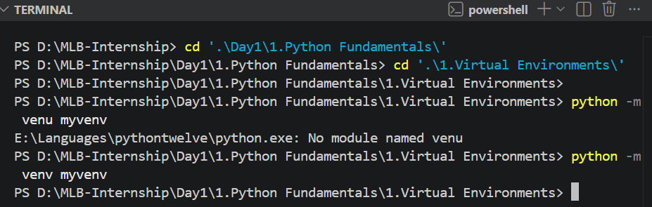

## 2. Activate

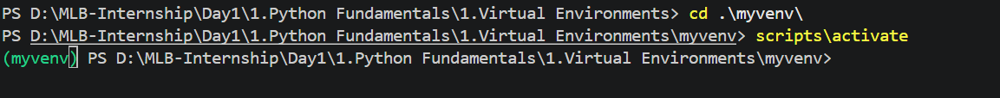

## 3. Install numpy

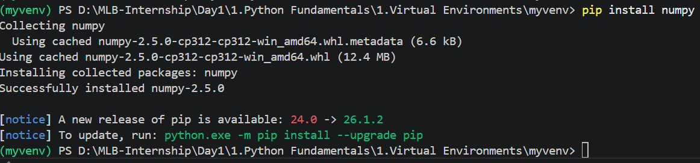

## 4. View installed Package

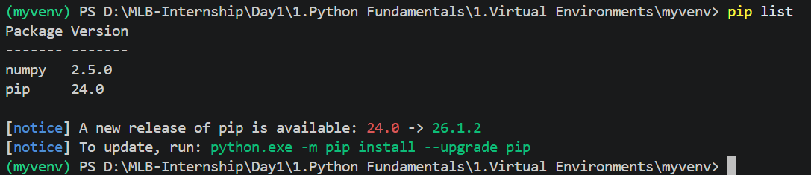

## 5. Save Packages in Requirements.txt

## Note: 
## Why Do We Use `requirements.txt`?

Instead of sharing the entire virtual environment (`venv`) folder, we share a **`requirements.txt`** file.

### Why?

- The `venv` folder contains files that are **specific to your own computer** (absolute paths, operating system settings, and local configurations).
- Because of this, the virtual environment created on your PC **will not work correctly on someone else's computer**.
- The `venv` folder is also **very large**, so it should **not** be pushed to GitHub.
- Instead, only the `requirements.txt` file is shared. It contains a list of all the Python packages and their versions used in the project.
- When another developer downloads the project, they should:
  1. Create **their own virtual environment**.
  2. Activate it.
  3. Install all the required packages using the `requirements.txt` file.

This ensures every developer has the **same package versions** while using a virtual environment that is created specifically for their own computer.


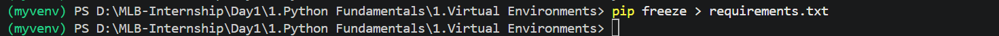

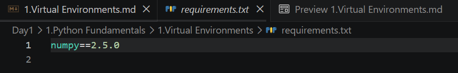

## 6. Installed packages from Requirements.txt
1. I take a file from internet, paste it into same folder then install packages from it

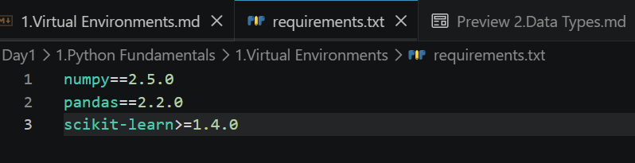

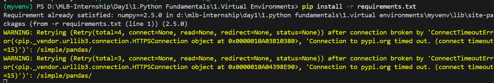

Note: no insatlled due to internet lost connection

## 7. Deactivate 

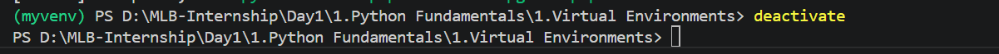

## 8. Again Activate and Check Version 

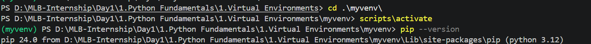

## 9. delete

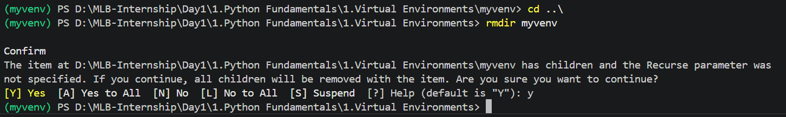

# References
1. https://www.w3schools.com/python/python_virtualenv.asp
2. Examples of Usage from AI

