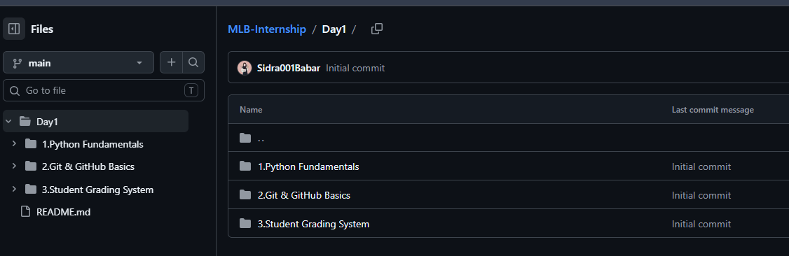

# Create a Repositoy 

Commands on git
1. git init
2. git add .
3. git status
4. git branch -M main
5. git checkout -b main
6. git commit -m "commit"
7. git remote add origin https://github.com/Sidra001Babar/MLB-Internship.git
8. git fetch origin
9. git rebase origin/main
10. git push -u origin main

## Verify

