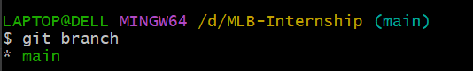
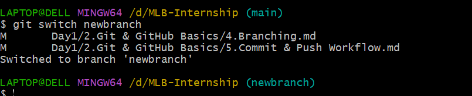
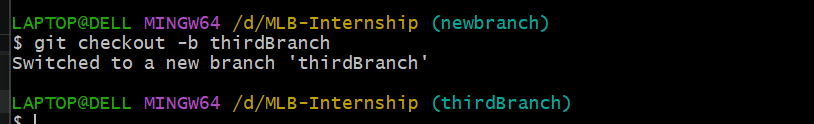
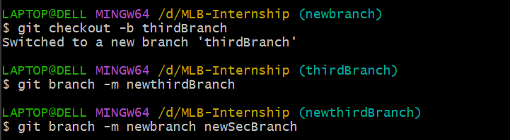
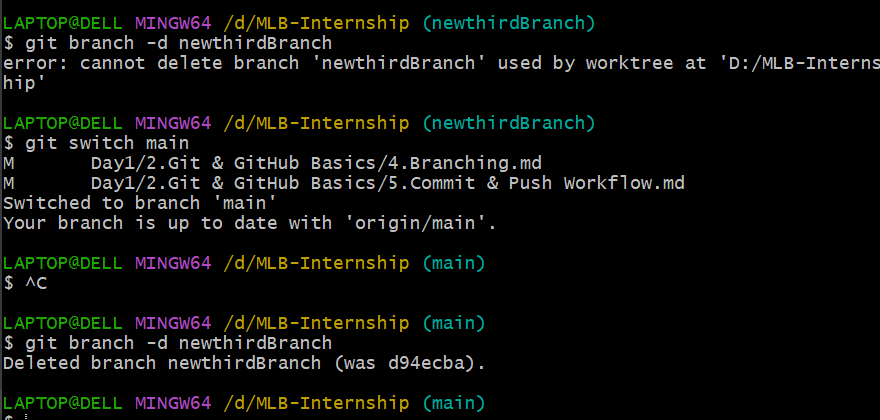
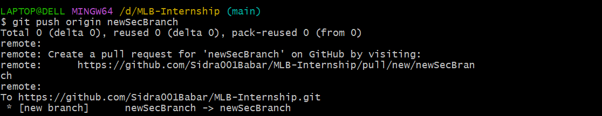
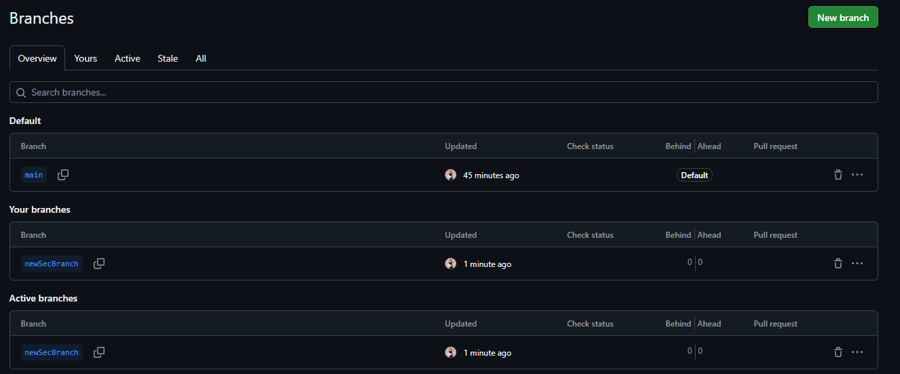

## Explanation
https://docs.github.com/en/pull-requests/collaborating-with-pull-requests/proposing-changes-to-your-work-with-pull-requests/about-branches

# Practical Work

## 1. Check Current Branch

```bash
git branch
```

The current branch will have a `*` before its name.



## 2. View All Local Branches

```bash
git branch
```

---

## 3. View All Remote Branches

```bash
git branch -r
```

Example:
```

origin/main
origin/development
origin/feature-login

```

---

## 4. View Both Local and Remote Branches

```bash
git branch -a
```

Example:
```

* main
development
remotes/origin/main
remotes/origin/development

```

---

## 5. Create a New Branch

```bash
git branch branch-name
```
it will create a local branch, it will not visible on github branches section


---

## 6. Switch to an Existing Branch

```bash
git checkout branch-name
```

or 
```bash
git switch branch-name
```



---

## 7. Create and Switch to a New Branch

Using checkout:

```bash
git checkout -b branch-name
```

Using switch:

```bash
git switch -c branch-name
```



---

## 8. Rename Current Branch

```bash
git branch -m new-branch-name
```


---

## 9. Rename Another Branch

```bash
git branch -m old-name new-name
```


---

## 10. Delete a Local Branch

```bash
git branch -d branch-name
```


---

## 11. Force Delete a Local Branch

```bash
git branch -D branch-name
```


---

## 12. Push a Branch to GitHub

```bash
git push origin branch-name
```




---

## 13. Push and Set Upstream

First time pushing a branch:

```bash
git push -u origin branch-name
```

Example:

```bash
git push -u origin feature-login
```

After this, simply use:

```bash
git push
```

---

## 14. Pull Latest Changes

```bash
git pull
```

---

## 15. Pull a Specific Branch

```bash
git pull origin branch-name
```

Example:

```bash
git pull origin development
```

---

## 16. Fetch Latest Branches from GitHub

```bash
git fetch
```

---

## 17. Fetch All Branches

```bash
git fetch --all
```

---

## 18. Merge a Branch

First switch to the target branch:

```bash
git switch main
```

Merge:

```bash
git merge feature-login
```

---

## 19. Delete a Branch on GitHub (Remote)

```bash
git push origin --delete branch-name
```

Example:

```bash
git push origin --delete feature-login
```

---

## 20. Clone a Repository

```bash
git clone repository-url
```

Example:

```bash
git clone https://github.com/username/project.git
```

---

## 21. Check Tracking Information

```bash
git branch -vv
```

Example:
```

* main 1c32ab3 [origin/main] Latest commit
feature-login 7fd44ab [origin/feature-login]

```

---

## 22. Show Current Branch Name Only

```bash
git branch --show-current
```

---

## 23. Show Git Status

```bash
git status
```

Displays:
- Current branch
- Modified files
- Staged files
- Untracked files

---

## 24. List Remote Repositories

```bash
git remote -v
```

Example:
```

origin https://github.com/user/project.git (fetch)
origin https://github.com/user/project.git (push)

```

---

# Steps to Verify Branches on GitHub

## Method 1: Using Git Commands

### Step 1

View local branches:

```bash
git branch
```

### Step 2

View remote branches:

```bash
git branch -r
```

### Step 3

View both local and remote branches:

```bash
git branch -a
```

### Step 4

Fetch latest branches from GitHub:

```bash
git fetch --all
```

Then run:

```bash
git branch -a
```

---

## Method 2: Verify on GitHub Website

1. Open your GitHub repository.
2. Click the **Branch** dropdown (usually showing `main`).
3. View all available branches.
4. You can also click the **Branches** page to see:
   - Active branches
   - Default branch
   - Recently updated branches

---

