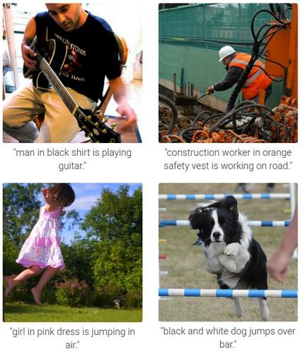
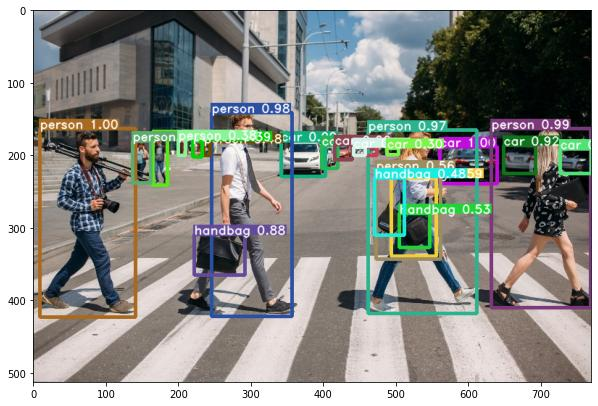
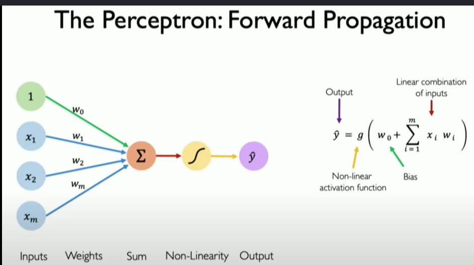
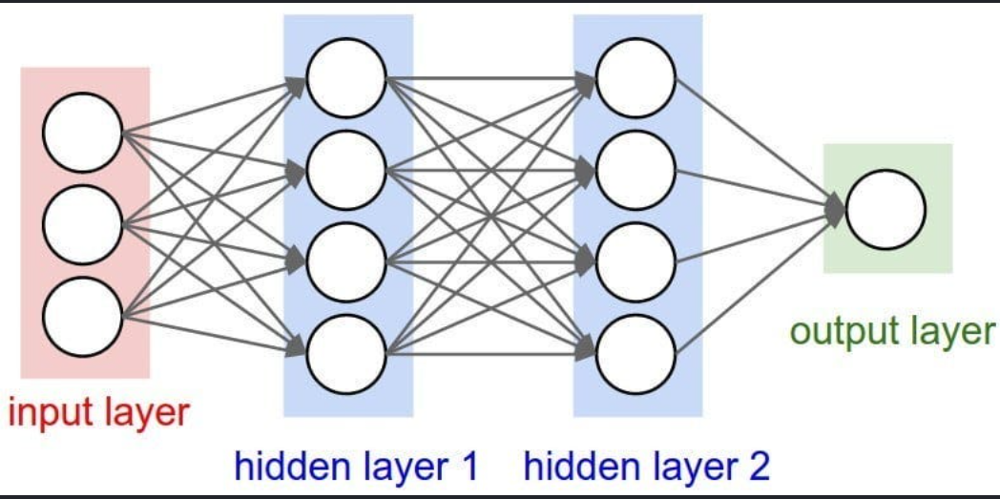

# Deep Learning (DL)

## What is Deep Learning?

Deep Learning (DL) is a subset of Machine Learning (ML) that uses **Artificial Neural Networks (ANNs)** with multiple hidden layers to learn patterns from large amounts of data automatically.

Unlike traditional Machine Learning, Deep Learning does **not require manual feature selection**. It learns features directly from raw data such as images, audio, text, and videos.

### Key Characteristics
- Uses Artificial Neural Networks (ANN)
- Requires large amounts of data
- Learns features automatically
- Performs exceptionally well on complex tasks
- Requires powerful hardware like GPUs/TPUs

# Machine Learning (ML) vs Deep Learning (DL)

| Feature | Machine Learning | Deep Learning |
|---------|------------------|---------------|
| Data Dependency | Works with small to medium datasets | Requires very large datasets |
| Hardware Dependency | CPU is usually enough | GPU/TPU is preferred |
| Training Time | Faster | Slower due to multiple layers |
| Feature Selection | Manual feature engineering required | Features learned automatically |
| Interpretability | Easier to understand and explain | Difficult to interpret (Black Box) |

## 1. Data Dependency

### Machine Learning
- Can perform well with less data.
- Suitable for structured datasets.

### Deep Learning
- Requires huge amounts of data.
- Performance improves as data increases.

Example:
- ML: 5,000 customer records
- DL: Millions of images

---

## 2. Hardware Dependency

### Machine Learning
- Can run efficiently on CPUs.

### Deep Learning
- Needs GPUs or TPUs because neural networks perform millions of calculations.

Examples:
- CPU → ML
- GPU → DL

---

## 3. Training Time

### Machine Learning
- Trains quickly.

### Deep Learning
- Takes much longer because many layers and parameters must be optimized.

Example:
Decision Tree → Seconds
Deep Neural Network → Hours or Days

---

## 4. Feature Selection

### Machine Learning
Features must be selected manually.

Example:
Image Classification:
- Shape
- Color
- Texture

### Deep Learning
The model automatically learns important features from raw images.

No manual feature engineering required.

---

## 5. Interpretability

### Machine Learning
Easy to understand why predictions were made.

Example:
Decision Trees show every decision.

### Deep Learning
Very difficult to understand internal decisions.

Often called a **Black Box Model**.

# Deep Learning Applications

## 1. Game Playing Agents

Deep Learning is used to build intelligent agents that learn strategies by playing games repeatedly.

Examples:
- Chess
- Go
- Dota 2
- Atari Games

Popular Systems:
- AlphaGo
- AlphaZero

Benefits:
- Learns from experience
- Beats human experts
- Improves continuously

## 2. Virtual Assistants

Deep Learning enables voice assistants to understand speech and answer questions.

Examples:
- Siri
- Google Assistant
- Alexa
- Cortana

Functions:
- Speech Recognition
- Natural Language Processing
- Voice Generation


## 3. Image Colorization

Deep Learning converts black-and-white images into realistic color images automatically.

Applications:
- Restoring old photographs
- Historical image enhancement
- Film restoration


## 4. Adding Audio to Mute Videos

Deep Learning can generate speech or synchronize audio with silent videos.

Applications:
- Movie restoration
- Video dubbing
- Lip-sync generation
- AI-generated narration

## 5. Image Caption Generation

Deep Learning automatically describes an image using natural language.

Example:
Image:
A dog playing with a ball.

Generated Caption:
"A brown dog is playing with a red ball."

Applications:
- Accessibility
- Image search
- Social media



## 6. Text Translation

Deep Learning translates text from one language to another.

Examples:
English → Urdu
English → French
English → Chinese

Popular Systems:
- Google Translate
- DeepL

## 7. Pixel Restoration

Deep Learning repairs damaged or low-quality images.

Tasks:
- Remove noise
- Remove blur
- Repair scratches
- Increase resolution

Applications:
- Medical Imaging
- Satellite Images
- Old Photo Restoration


## 8. Object Detection

Deep Learning identifies and locates multiple objects within an image.

Example:
Image:
- Person
- Car
- Bicycle
- Dog

The model draws bounding boxes around each object.

Applications:
- Security cameras
- Autonomous vehicles
- Face detection
- Retail analytics



## 9. Deep Dreaming

Deep Dream is a Deep Learning technique that enhances patterns detected by a neural network to create dream-like artistic images.

Purpose:
- Visualize what neural networks learn
- Generate artistic images

Applications:
- AI Art
- Neural Network Visualization
- Creativity Tools

# What is a Perceptron?

A **Perceptron** is the simplest type of **Artificial Neural Network (ANN)** and the basic building block of Deep Learning.

It was introduced by **Frank Rosenblatt in 1958**.

A perceptron receives multiple input values, assigns weights to them, calculates a weighted sum, applies an activation function, and produces a single output.

It is mainly used for **binary classification**, where the output is either:
- 0 (False)
- 1 (True)



## Components of a Perceptron

- Input (x₁, x₂, x₃, ...)
- Weights (w₁, w₂, w₃, ...)
- Bias (b)
- Weighted Sum
- Activation Function
- Output

## Mathematical Equation

Weighted Sum:

z = (w₁x₁ + w₂x₂ + ... + wₙxₙ) + b

Output:

y = Activation(z)

where:
- x = Inputs
- w = Weights
- b = Bias
- z = Weighted Sum
- y = Final Output

# How a Perceptron Makes Decisions

A perceptron makes decisions in four simple steps.

## Step 1: Receive Inputs

The perceptron receives one or more input values.

Example:

x₁ = 2
x₂ = 3

---

## Step 2: Multiply Inputs by Weights

Each input is multiplied by its corresponding weight.

Example:

w₁ = 0.5
w₂ = 0.8

Weighted values:

2 × 0.5 = 1

3 × 0.8 = 2.4

---

## Step 3: Add Bias

The weighted values are added together along with the bias.

Example:

Bias = -1

z = (1 + 2.4) - 1

z = 2.4

---

## Step 4: Apply Activation Function

The activation function decides whether the neuron should "fire."

If z is greater than or equal to the threshold,
the output becomes 1.

Otherwise,
the output becomes 0.

Final Output:

Output = 1


# Example

Inputs:

x₁ = 1

x₂ = 2

Weights:

w₁ = 0.6

w₂ = 0.4

Bias:

b = -0.5

## Step 1

Weighted Sum

z = (1×0.6) + (2×0.4) - 0.5

z = 0.6 + 0.8 - 0.5

z = 0.9

## Step 2

Apply Step Activation Function

Since z ≥ 0

Output = 1

Prediction: TRUE


# Activation Functions

An **Activation Function** is a mathematical function that determines whether a neuron should be activated (fire) or not.

It takes the weighted sum of inputs and bias as input and produces the neuron's final output.

Mathematically:

z = (w₁x₁ + w₂x₂ + ... + wₙxₙ) + b

Output = Activation(z)

Without an activation function, a neural network behaves like a simple linear model and cannot learn complex patterns.

# Why Activation Functions are Important?

Activation functions are one of the most important components of Deep Learning.

## Importance

### 1. Introduce Non-Linearity
- Real-world data is complex and non-linear.
- Activation functions allow neural networks to learn these complex relationships.

Example:
- Image Recognition
- Speech Recognition
- Language Translation

---

### 2. Help Neural Networks Learn Complex Patterns

Without activation functions:

Input → Linear Equation → Output

No matter how many layers are added, the network behaves like one linear equation.

With activation functions:

Input → Hidden Layers → Non-linear Learning → Accurate Output

---

### 3. Decide Whether a Neuron Should Activate

Activation functions determine whether the neuron passes information to the next layer.

If the output is important:
Neuron activates.

Otherwise:
Neuron remains inactive.

---

### 4. Improve Prediction Accuracy

They enable deep neural networks to solve complex tasks with much higher accuracy.

Examples:
- Face Recognition
- Object Detection
- Self-driving Cars

---

### 5. Enable Deep Neural Networks

Without activation functions:
- Deep Learning would not work effectively.
- Multiple layers would be equivalent to a single layer.


# Sigmoid Activation Function

The Sigmoid function converts any input into a value between **0 and 1**.

Formula:

f(x) = 1 / (1 + e⁻ˣ)

## Output Range

0 to 1

## Graph Shape

S-shaped (Sigmoid Curve)

## Advantages

- Produces probability values.
- Smooth and continuous.
- Useful for binary classification.

## Disadvantages

- Suffers from the Vanishing Gradient Problem.(cover later)
- Slower training in deep networks.

## Applications

- Binary Classification
- Logistic Regression
- Output layer of binary classifiers

# ReLU Activation Function

ReLU stands for **Rectified Linear Unit**.

It returns:
- 0 for negative inputs.
- The input itself for positive inputs.

Formula:

f(x) = max(0, x)

## Output Range

0 to ∞

## Advantages

- Very fast.
- Simple to compute.
- Reduces the Vanishing Gradient Problem.
- Most commonly used in hidden layers.

## Disadvantages

- Can suffer from the Dying ReLU problem (neurons may stop learning if they always output 0).

## Applications

- Hidden layers of Deep Neural Networks
- Computer Vision
- Image Classification


# Tanh Activation Function

The Tanh function converts input values into outputs between **-1 and 1**.

Formula:

f(x) = tanh(x)

## Output Range

-1 to 1

## Advantages

- Zero-centered output.
- Learns faster than Sigmoid.
- Better optimization during training.

## Disadvantages

- Still suffers from the Vanishing Gradient Problem.

## Applications

- Hidden layers in some neural networks
- Recurrent Neural Networks (RNNs)


# Softmax Activation Function

Softmax converts multiple output values into probabilities.

The probabilities always add up to 1.

Unlike Sigmoid, Softmax is used when there are more than two classes.

Formula:

Softmax(xᵢ) = eˣⁱ / Σeˣ

## Output Range

0 to 1

The sum of all outputs = 1

## Advantages

- Produces probability distribution.
- Best for multi-class classification.
- Easy to identify the most likely class.

## Disadvantages

- More computationally expensive than Sigmoid.
- Sensitive to very large input values.

## Applications

- Image Classification
- Handwritten Digit Recognition
- Language Translation
- Text Classification


# Artificial Neural Network (ANN)

An **Artificial Neural Network (ANN)** is a computer model inspired by the way the human brain processes information.

It consists of interconnected nodes called **neurons**, which work together to learn patterns from data and make predictions or decisions.

ANNs are the foundation of **Deep Learning** and are widely used for tasks such as image recognition, speech recognition, natural language processing, and recommendation systems.(doubt in 1(CNN) and 2(RNN) )

---

## Characteristics of ANN

- Inspired by the human brain.
- Consists of interconnected neurons.
- Learns from training data.
- Can recognize complex patterns.
- Improves performance through learning.

---

## Basic Components of ANN

1. Input Layer
2. Hidden Layer(s)
3. Output Layer
4. Weights
5. Bias
6. Activation Function

---

## How ANN Works

Step 1:
Receive input data.

↓

Step 2:
Multiply inputs by weights.

↓

Step 3:
Add bias.

↓

Step 4:
Apply activation function.

↓

Step 5:
Pass output to the next layer.

↓

Step 6:
Generate the final prediction.

---

## Mathematical Representation

Weighted Sum:

z = (w₁x₁ + w₂x₂ + ... + wₙxₙ) + b

Output:

y = Activation(z)

Where:

- x = Inputs
- w = Weights
- b = Bias
- z = Weighted Sum
- y = Output




# Layers in a Neural Network

A neural network is made up of multiple layers of neurons.

The three main layers are:

1. Input Layer
2. Hidden Layer(s)
3. Output Layer

Each layer has a specific role in processing information.

Data always flows in this order:

Input Layer → Hidden Layer(s) → Output Layer

# Input Layer

The **Input Layer** is the first layer of a neural network.

Its job is to receive the input data and pass it to the hidden layer.

The input layer **does not perform calculations**; it simply forwards the data.

---

## Characteristics

- First layer of the network.
- Receives raw input data.
- One neuron represents one input feature.
- Passes information to the hidden layer.

---

## Example

Suppose we want to predict whether a student will pass an exam.

Input Features:

- Hours Studied
- Attendance
- Assignment Score

Input Layer

Hours Studied ──► ○

Attendance ─────► ○

Assignment ────► ○

These values are sent to the hidden layer.

# Hidden Layer

The **Hidden Layer** is located between the input layer and the output layer.

It performs most of the learning by applying weights, biases, and activation functions to the input data.

A neural network may have one or many hidden layers.

When a network has multiple hidden layers, it is called a **Deep Neural Network**.

---

## Functions of Hidden Layer

- Learns patterns from data.
- Performs mathematical calculations.
- Applies activation functions.
- Extracts useful features.
- Passes processed information to the next layer.

---

## Example

Input:

Hours Studied = 8

Attendance = 90%

Assignment = 85%

The hidden layer combines these inputs and learns relationships such as:

- Higher study hours improve performance.
- Better attendance increases the chance of passing.
- Good assignments contribute positively.

The processed information is then passed to the output layer.

# Output Layer

The **Output Layer** is the final layer of the neural network.

It produces the final prediction or decision.

The number of neurons depends on the type of problem.

---

## Binary Classification

One output neuron

Example:

Pass or Fail

Output:

0 → Fail

1 → Pass

---

## Multi-Class Classification

Multiple output neurons

Example:

Animal Classification

Outputs:

Cat

Dog

Horse

The neuron with the highest probability is selected.

---

## Regression Problems

One output neuron

Example:

Predict House Price

Output:

$250,000


# TensorFlow

**TensorFlow** is an open-source machine learning and deep learning framework developed by Google. It is used to build, train, and deploy neural network models for tasks like image classification, NLP, speech recognition, and more.

---

# Sequential Model

A **Sequential** model is the simplest Keras model where layers are added one after another in a linear order.

```python
from tensorflow.keras.models import Sequential

model = Sequential([
    ...
])
```

It is suitable for models with **one input and one output**.

---

# Flatten Layer

The **Flatten** layer converts multi-dimensional input into a one-dimensional vector.

For Fashion MNIST:

```
28 × 28  →  784
```

It does not change the data values—only the shape.

```python
keras.layers.Flatten(input_shape=(28, 28))
```

---

# Dense Layer

A **Dense** layer is a fully connected layer where every neuron is connected to all neurons in the previous layer.

```python
keras.layers.Dense(128, activation="relu")
```

- **128** → Number of neurons
- **ReLU** → Activation function for learning patterns

Output layer:

```python
keras.layers.Dense(10, activation="softmax")
```

- **10** → One neuron for each Fashion MNIST class
- **Softmax** → Converts outputs into probabilities

---

# Model Structure

```text
Input (28×28)
      │
   Flatten
      │
Dense (128, ReLU)
      │
Dense (10, Softmax)
      │
 Prediction
```