# Detailed Comparison: ANN vs CNN

| Feature | Artificial Neural Network (ANN) | Convolutional Neural Network (CNN) |
|---------|----------------------------------|------------------------------------|
| **Full Form** | Artificial Neural Network | Convolutional Neural Network |
| **Primary Purpose** | Designed for general-purpose machine learning tasks such as classification and regression. | Specifically designed for processing image, video, and other grid-like data. |
| **Input Data** | Accepts one-dimensional (1D) feature vectors. | Accepts two-dimensional (2D) or three-dimensional (3D) data while preserving spatial structure. |
| **Image Handling** | Images must be flattened into a 1D vector before being processed. | Images are processed directly in their original 2D form. |
| **Spatial Information** | Loses the relationship between neighboring pixels after flattening. | Preserves spatial relationships between pixels, helping identify patterns and objects. |
| **Feature Extraction** | Does not automatically extract features; it relies on the input representation. | Automatically learns important features such as edges, corners, textures, and shapes. |
| **Architecture** | Consists mainly of fully connected (Dense) layers. | Uses convolutional layers, pooling layers, and fully connected layers. |
| **Connections Between Neurons** | Every neuron is connected to every neuron in the next layer (Fully Connected). | Each neuron connects only to a small local region of the input (Local Receptive Fields). |
| **Number of Parameters** | Very high because every neuron has its own weight. | Much lower because filters (kernels) share the same weights across the image. |
| **Weight Sharing** | No weight sharing. Every connection has a unique weight. | Uses weight sharing, where the same filter is applied across the entire image. |
| **Memory Requirement** | High memory usage due to a large number of parameters. | Lower memory usage because of shared weights and fewer parameters. |
| **Computational Cost** | Higher for image data because of many parameters. | More computationally efficient for images despite convolution operations. |
| **Learning Ability** | Learns global relationships but struggles with local image patterns. | Learns both local and global image features effectively. |
| **Hierarchy of Features** | Does not naturally learn hierarchical features. | Learns features hierarchically: edges → textures → shapes → objects. |
| **Translation Invariance** | Sensitive to object position. A shifted image may reduce accuracy. | Can recognize objects even if they appear in different positions within the image. |
| **Pooling Operation** | Not available. | Uses pooling (Max Pooling or Average Pooling) to reduce feature dimensions and improve robustness. |
| **Image Accuracy** | Generally lower for image classification tasks. | Generally much higher for image classification tasks. |
| **Training Speed** | Can be slower for image data due to many parameters. | Usually trains faster and more efficiently for image tasks. |
| **Overfitting Risk** | Higher because of a large number of trainable weights. | Lower compared to ANN due to parameter sharing and pooling. |
| **Scalability** | Performance decreases as image size increases because the number of parameters grows rapidly. | Scales better to larger images since filters are reused. |
| **Interpretability** | Hard to identify what individual neurons learn. | Feature maps can often be visualized to understand what the model has learned. |
| **Best Suited For** | Tabular data, numerical data, regression, and basic classification tasks. | Images, videos, facial recognition, object detection, medical imaging, and computer vision tasks. |
| **Common Applications** | House price prediction, customer churn prediction, fraud detection, sales forecasting, sentiment analysis. | Face recognition, autonomous vehicles, image classification, medical diagnosis, OCR, satellite image analysis, video surveillance. |

---
Note : In Ann when image flatten(2D to 1D) each pixel will connect to node of dense layer having its own weight

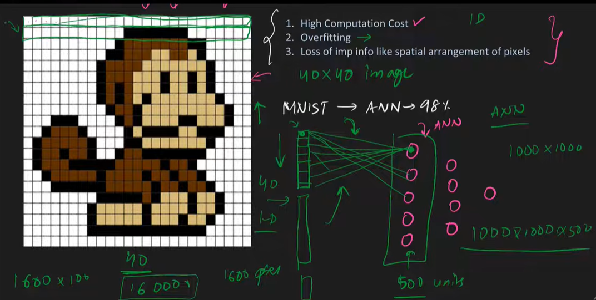

## ANN with a 40 × 40 Image

In an **Artificial Neural Network (ANN)**, an image cannot be processed directly. Therefore, the image is first **flattened** into a one-dimensional (1D) vector.

### Example

- **Image Size:** 40 × 40 pixels
- **Total Pixels:** 40 × 40 = **1600**
- **Hidden Layer:** 5 neurons

After flattening:

- The image becomes a vector of **1600 input values**.
- These **1600 inputs** act as **1600 input neurons**.
- Every input neuron is connected to **every hidden neuron** (Fully Connected Layer).

### Number of Connections

Since there are **1600 input neurons** and **5 hidden neurons**:


### Trainable Parameters

- **Weights:** 1600 × 5 = **8000**
- **Biases:** 5 (one for each hidden neuron)

**Total Trainable Parameters = 8000 + 5 = 8005**

Note : Also when it converts into 1D distance between features is lost like distance between eyes and nose of money as in the image, so it will become the cause of loss of spetial information

## Examples how cnn work layer by layer
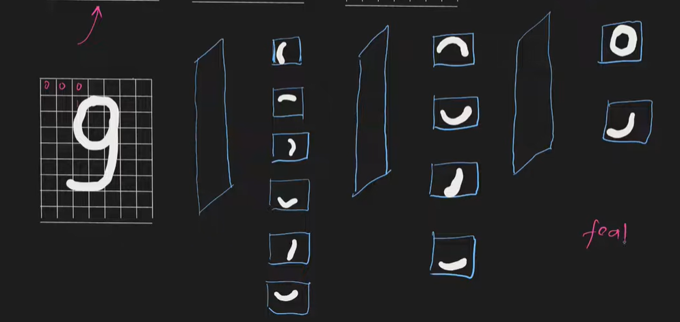

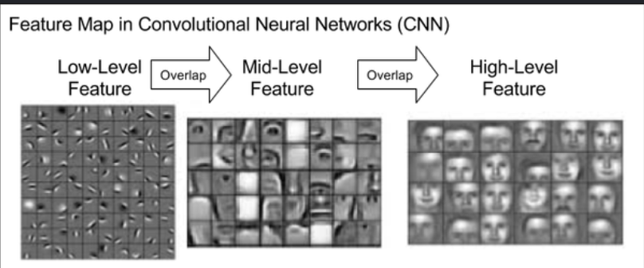

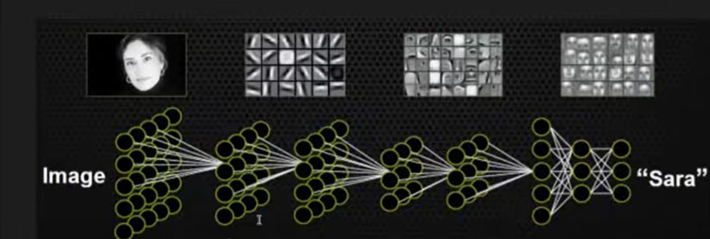

> **Conclusion:** ANN treats an image as a simple list of numbers after flattening. This creates many parameters and loses spatial information, which is why **Convolutional Neural Networks (CNNs)** are preferred for image classification tasks.
# Example: Processing a 28 × 28 Image

### ANN

```
28 × 28 Image
      │
      ▼
Flatten
      │
      ▼
784 Features
      │
      ▼
Dense Layers
      │
      ▼
Prediction
```

**Problem:** Flattening removes the spatial relationship between neighboring pixels.

---

### CNN

```
28 × 28 Image
      │
      ▼
Convolution Layer
      │
      ▼
Feature Maps
      │
      ▼
Pooling Layer
      │
      ▼
Flatten
      │
      ▼
Dense Layer
      │
      ▼
Prediction
```

**Advantage:** The convolution and pooling layers preserve and learn important visual features before classification.

---

# CNN - Convolutional Neural Network
# 1. Convolution Layer

The **Convolution Layer** is the most important layer in a CNN. It is responsible for extracting meaningful features from an image.

Instead of looking at the entire image at once, it scans the image using a small matrix called a **filter (kernel)**.

As the filter moves across the image, it performs element-wise multiplication and addition to detect patterns such as:

- Edges
- Lines
- Corners
- Textures
- Shapes

These detected patterns become the input for the next layer.

### Example

Input Image

```
1 1 1 0
0 1 1 1
1 0 1 1
0 1 0 1
```

3 × 3 Filter

```
1 0 1
0 1 0
1 0 1
```

The filter slides over the image one position at a time and computes a value for each region.

### Advantages

- Learns important image features automatically.
- Preserves spatial relationships.
- Uses fewer parameters than ANN.

---

# 2. Filters (Kernels)

A **Filter (Kernel)** is a small matrix of learnable weights that scans the image.

Common filter sizes:

- 3 × 3
- 5 × 5
- 7 × 7

Initially, filter values are random.

During training, the CNN learns the best filter values using backpropagation.

Different filters learn different features.

For example:

| Filter Learns | Purpose |
|---------------|---------|
| Horizontal Edge Filter | Detects horizontal edges |
| Vertical Edge Filter | Detects vertical edges |
| Texture Filter | Detects textures |
| Shape Filter | Detects object shapes |

### Example Filter

```
1 0 -1
1 0 -1
1 0 -1
```

This filter detects **vertical edges**.

---

# 3. Feature Maps

The output produced after applying a filter is called a **Feature Map** (also called an Activation Map).

Each filter creates **one feature map**.

If a CNN uses:

- 32 filters → 32 feature maps
- 64 filters → 64 feature maps

A feature map highlights where a particular feature exists in the image.

### Example

Original Image

```
🧥
```

Feature Map 1

```
Edges
```

Feature Map 2

```
Corners
```

Feature Map 3

```
Texture
```

The deeper the CNN becomes, the more complex the detected features become.

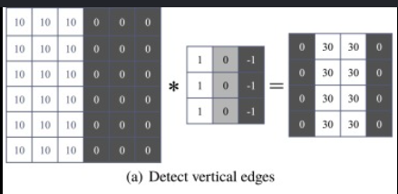


---
here box no 1 is representing the image, box no 2 is representing the filter and box no 3 is representing the feature map, notice that feature map's size is less than the size of image

# Problems of Feature Maps (Without Padding)

When a convolution operation is performed **without padding (Valid Padding)**, it creates two major problems.

---

## 1. Feature Map Size Becomes Smaller

During convolution, the filter cannot move beyond the image boundaries.

As a result, the output feature map is **smaller** than the original image.

### Example

Input Image

```
28 × 28
```

Using

- Filter Size = 3 × 3
- Padding = 0
- Stride = 1

Output Feature Map

```
26 × 26
```

After several convolution layers:

```
28 × 28
      ↓
26 × 26
      ↓
24 × 24
      ↓
22 × 22
```

The image keeps shrinking, causing a loss of information.

---

## 2. Edge Pixels Are Used Less Frequently

During convolution, the filter slides over the image.

### Middle Pixels

A pixel in the **center** of the image is covered by the filter many times.

```
□□□□□□□□□
□□■□□□□□□
□□□■□□□□□
□□□□■□□□□
```

The center pixel contributes to many convolution operations.

---

### Edge Pixels

Pixels on the **corners and edges** are covered only a few times because the filter cannot extend outside the image.

```
■□□□□□□□□
□□□□□□□□□
□□□□□□□□□
```

These pixels contribute much less to the feature maps.

This creates a problem because important information located near the image boundaries may be ignored.

For example:

- Face near image border
- Traffic sign at the edge of a road image
- Object touching the image boundary

The CNN may fail to learn these features effectively.

---

# Solution: Padding

To solve these problems, **Padding** is added around the image before convolution.

Padding adds extra rows and columns (usually filled with zeros) around the border.

Example

Original Image

```
1 2 3
4 5 6
7 8 9
```

After Zero Padding

```
0 0 0 0 0
0 1 2 3 0
0 4 5 6 0
0 7 8 9 0
0 0 0 0 0
```

Now the filter can also process the border pixels properly.

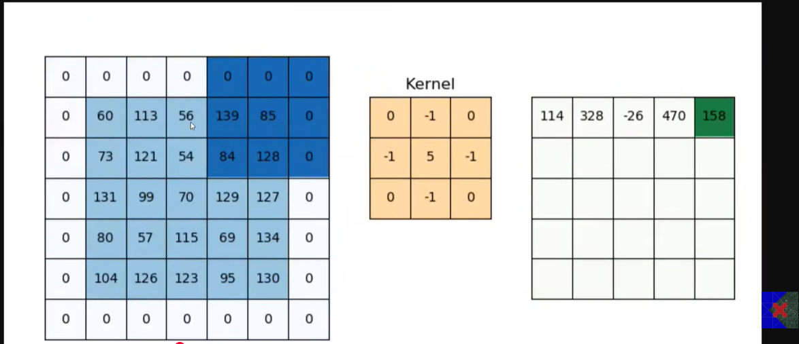

---

# Advantages of Padding

- Preserves image size.
- Ensures edge and corner pixels are used more often.
- Prevents loss of important information near image boundaries.
- Allows deeper CNNs without rapidly shrinking feature maps.

---

# Types of Padding

## 1. Valid Padding

- No padding is added.
- Output feature map becomes smaller.

Example:

```
Input : 28 × 28
Filter: 3 × 3

Output: 26 × 26
```

---

## 2. Same Padding

- Padding is added around the image.
- Output feature map has the same height and width as the input.

Example:

```
Input : 28 × 28
Filter: 3 × 3
Padding: 1

Output: 28 × 28
```

---
## Code example with out padding with results (YT)

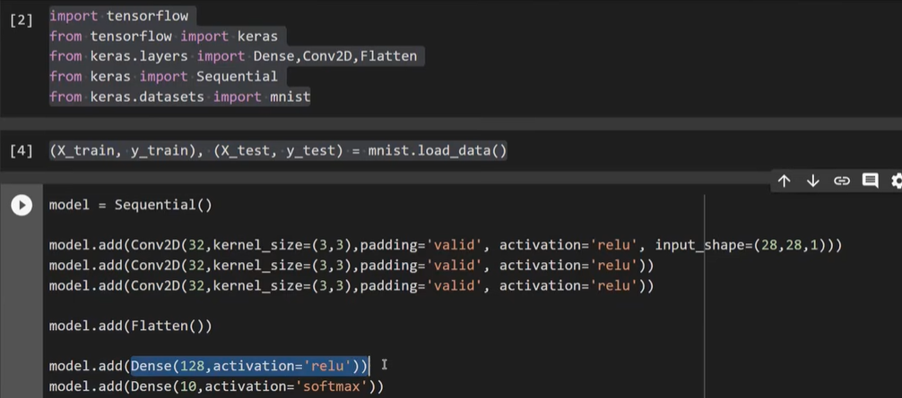

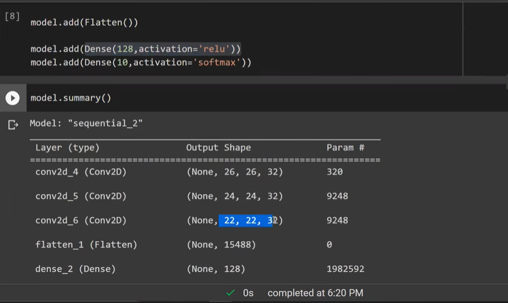
## Code example after padding with results (YT)

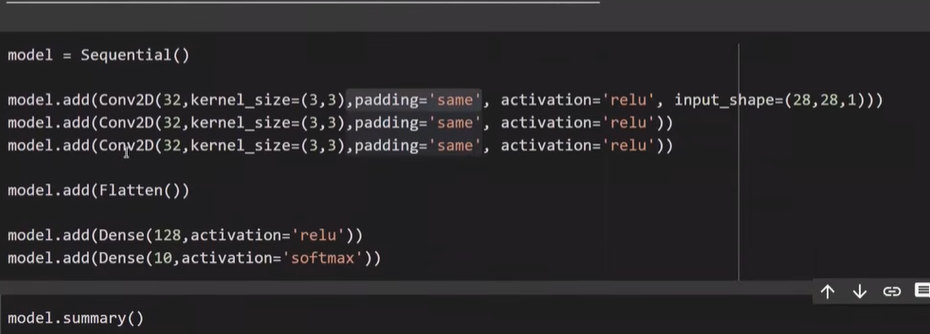

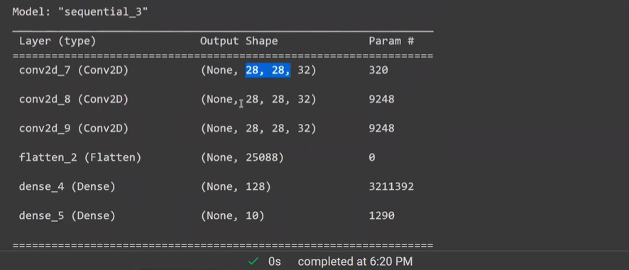

### Result

Without padding, convolution gradually reduces the size of the feature maps and gives less importance to pixels at the image boundaries. This can lead to the loss of valuable information. **Padding** solves these issues by adding extra pixels around the image, preserving its dimensions and ensuring that border features are learned effectively.

## What is Stride and how it effects the feature map
### What is Stride in CNN?

**Stride** is the number of pixels the **filter (kernel)** moves across the image during the convolution operation.

- **Stride = 1:** The filter moves **one pixel at a time**.
- **Stride = 2:** The filter moves **two pixels at a time**.
- **Stride = 3:** The filter moves **three pixels at a time**, and so on.

The stride determines **how much the filter shifts after each convolution operation**.

---

# Example: Stride = 1

Suppose we have a **5 × 5** input image and a **3 × 3** filter.

Input Image

```
1 2 3 4 5
6 7 8 9 1
2 3 4 5 6
7 8 9 1 2
3 4 5 6 7
```

Filter

```
1 0 1
0 1 0
1 0 1
```

With **Stride = 1**, the filter moves **one pixel** after every calculation.

```
Step 1

[F F F] 4 5
[F F F] 9 1
[F F F] 5 6
 7 8 9 1 2
 3 4 5 6 7
```

↓

Move one pixel right

```
1 [F F F] 5
6 [F F F] 1
2 [F F F] 6
7 8 9 1 2
3 4 5 6 7
```

The filter visits almost every location.

Output Feature Map Size

```
3 × 3
```

---

# Example: Stride = 2

Now the filter moves **two pixels** at a time.

```
[F F F] 4 5
[F F F] 9 1
[F F F] 5 6
7 8 9 1 2
3 4 5 6 7
```

↓

Move **two pixels** instead of one

```
1 2 [F F F]
6 7 [F F F]
2 3 [F F F]
7 8 9 1 2
3 4 5 6 7
```

Many positions are skipped.

Output Feature Map Size

```
2 × 2
```

---

### Effect of Stride on Feature Maps

The stride directly affects the **size** of the output feature map.

### Stride = 1

- Filter moves slowly.
- More convolution operations are performed.
- Larger feature map.
- More image details are preserved.
- Higher computational cost.

Example

```
Input

28 × 28

↓

Feature Map

26 × 26
```

---

### Stride = 2

- Filter jumps two pixels each time.
- Fewer convolution operations.
- Smaller feature map.
- Some image details may be skipped.
- Faster computation.

Example

```
Input

28 × 28

↓

Feature Map

13 × 13
```

---

### Stride = 3

- Filter jumps three pixels.
- Very small feature map.
- Fast computation.
- Greater loss of image information.

---
### Question: If the image size = 6 × 7, filter size = 3 × 3, stride = 2, and padding = 0, then size of feature map will be ?? this is special case when pixels of image needs to skip

### Reasons for Using Stride

1. **Reduce Computational Cost**
   - Produces a smaller feature map.
   - Requires fewer calculations, less memory, and faster training.

2. **Capture High-Level Features**
   - Skips some pixels and focuses on larger patterns instead of fine details.
Note: stride's value greater then one is not recommended when there is need to capture low level features

stride(2,2): move by 2 in horzontal direction and 2 in vertical direction

### Code Example(YT)

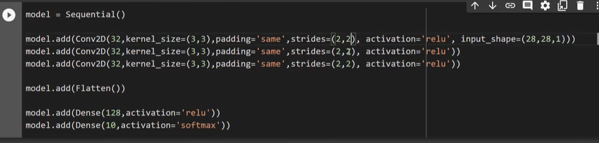

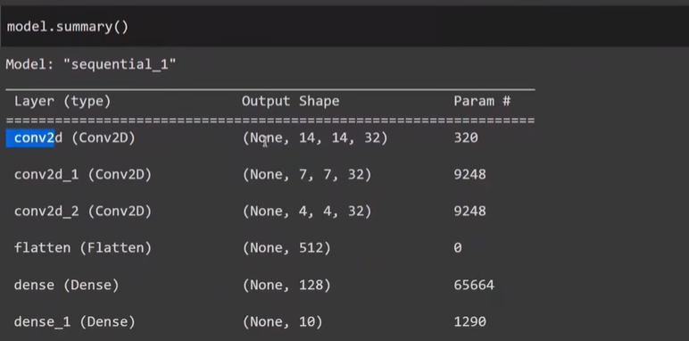


# 4. Pooling Layer

The **Pooling Layer** reduces the size of feature maps while keeping the most important information.

Benefits:

- Reduces computation
- Reduces memory usage
- Reduces overfitting
- Speeds up training

There are two common types of pooling.

---

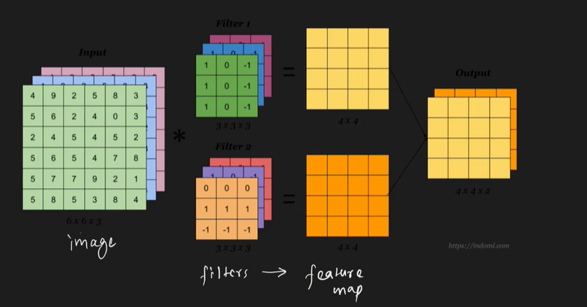

## Why Do We Use Pooling Layers in CNN?

After the convolution layer extracts features from an image, we apply a **Pooling Layer** to make the CNN more efficient and robust.

Pooling solves two major problems:

1. **Translation Variance (Location Dependence)**
2. **Large Feature Maps (High Computation and Memory Usage)**

---

### Problem 1: Translation Variance (Location Dependence)

After convolution, the extracted features are still **location-dependent**.

This means that if an object moves slightly within the image, the locations of the activated features also change.

Ideally, the CNN should recognize an object **regardless of where it appears** in the image.

For example, consider an image of a cat.

### Image 1

```
🐱
```

The cat is in the center.

---

### Image 2

```
      🐱
```

The cat has moved slightly to the right.

Although it is the **same cat**, the feature map produced by the convolution layer changes because the activated values shift to different positions.

The CNN becomes **translation-variant**, meaning it is sensitive to the object's position.

---

### Why is this a Problem?

Suppose a CNN is trained to recognize shoes.

```
Image A

👟
```

During testing:

```
      👟
```

The shoe is simply shifted to the right.

Without pooling, the CNN may produce a different feature representation because the activations have moved.

However, the object has **not changed**—only its location has.

The CNN should recognize the shoe in both cases.

---

### Solution: Pooling

Pooling combines nearby activations into a single representative value.

Instead of remembering the **exact position** of a feature, it remembers **whether the feature exists** in a small region.

For example, using **2 × 2 Max Pooling**:

Before Pooling

```
0 1
2 5
```

After Max Pooling

```
5
```

The exact location of the strongest activation is ignored.

Only the presence of the important feature is retained.

This makes the CNN more **translation invariant**, meaning it can recognize features even if they move slightly within the image.

---

## Translation Variance vs Translation Invariance

### Before Pooling

```
Feature at

(5,6)
```

After shifting the object

```
Feature at

(6,7)
```

The feature map changes significantly.

---

### After Pooling

Both feature maps may produce the same pooled value.

```
5
```

The CNN focuses on **what** the feature is rather than **where** it is.

---

## Problem 2: Large Feature Maps

Convolution layers often generate many large feature maps.

Example:

Input Image

```
28 × 28
```

After Convolution

```
26 × 26 × 32
```

This means:

- Height = 26
- Width = 26
- Number of feature maps = 32

As the network becomes deeper, storing and processing these feature maps requires significant memory and computation.

---

## Solution: Downsampling

Pooling reduces the size of feature maps.

Example:

Before Max Pooling

```
26 × 26
```

After 2 × 2 Max Pooling

```
13 × 13
```

The height and width are reduced by half.

Benefits:

- Less memory usage
- Faster computation
- Fewer parameters in later layers
- Reduced risk of overfitting

---

# Example

Original Feature Map

```
1 3 2 1
4 6 5 2
3 1 7 8
2 5 4 6
```

Using **2 × 2 Max Pooling**

Window 1

```
1 3
4 6
```

Maximum = **6**

Window 2

```
2 1
5 2
```

Maximum = **5**

Window 3

```
3 1
2 5
```

Maximum = **5**

Window 4

```
7 8
4 6
```

Maximum = **8**

Output Feature Map

```
6 5
5 8
```

The feature map is now much smaller while preserving the strongest features.

---

| Problem | Without Pooling | With Pooling |
|----------|-----------------|--------------|
| Translation Variance | Features are tied to exact locations. | Features become more location-independent (translation invariant). |
| Feature Map Size | Large feature maps require more computation and memory. | Smaller feature maps reduce computation and memory usage. |
| Computational Cost | High | Lower |
| Memory Usage | High | Lower |
| Overfitting | More likely | Reduced |

---

# Types of Pooling
YT: max pooling, min pooling, average pooling, L2 pooling and Global pooling
## A. Max Pooling

Max Pooling selects the **largest value** from each region.

Note: in model summary notice paramter values are 0 in case of max pooling because it is a navigating function only
Example

Input

```
1 3
5 2
```

Output

```
5
```

Only the maximum value is retained.

### Advantages

- Preserves the strongest features.
- Most commonly used pooling technique.
- Improves robustness to small shifts in the image.

---
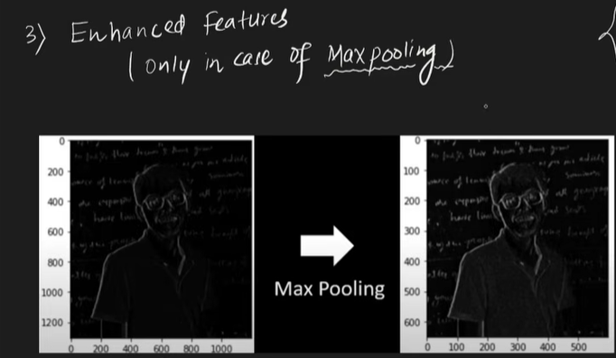
## B. Average Pooling

Average Pooling computes the **average value** of each region.

Example

Input

```
1 3
5 2
```

Output

```
(1 + 3 + 5 + 2) / 4 = 2.75
```

### Advantages

- Produces smoother feature maps.
- Retains overall information rather than only the strongest feature.

---

## Max Pooling vs Average Pooling

| Feature | Max Pooling | Average Pooling |
|----------|-------------|-----------------|
| Operation | Selects the maximum value | Computes the average value |
| Preserves | Strongest features | Overall information |
| Most Common | Yes | Less common |
| Performance | Usually better for image classification | Often used in specialized applications |

---
## Overall Advantages of pooling
1. Decrease feature map size so dec computationa cost
2. Solve the problem of translation variance(location dependecy of features)
3. No training in this layer as it is a aggregating function

23:00 onward Visual understanding of global max pooling and global avg pooling

## Disadvantages of pooling
1. No use in scenerios where image locatoin is also important likr image segmentaion tasks
2. In some cases loss a lot of information
# 5. Flatten Layer

After several convolution and pooling operations, the output is still a multi-dimensional feature map.

The **Flatten Layer** converts this multi-dimensional data into a one-dimensional vector so it can be passed to fully connected layers.

Example

Before Flatten

```
2 × 2 × 3 Feature Map
```

```
[
 [[1,2,3],
  [4,5,6]],

 [[7,8,9],
  [2,1,0]]
]
```

After Flatten

```
[1,2,3,4,5,6,7,8,9,2,1,0]
```

The Flatten layer **does not learn anything**.

It only reshapes the data.

---

# 6. Fully Connected (Dense) Layer

The **Fully Connected Layer** is similar to the Dense layers used in an ANN.

Every neuron is connected to every neuron in the next layer.

Its job is to combine all the extracted features and perform classification.

Example

Features learned:

- Edges
- Sleeves
- Collar
- Texture

↓

Dense Layer

↓

Prediction

```
T-Shirt
```

Usually, CNNs contain one or more fully connected layers before the final output layer.

---

# Output Layer

The final layer is usually a **Softmax Layer**.

It converts the output into probabilities.

Example for Fashion MNIST

| Class | Probability |
|---------|------------|
| T-shirt | 0.02 |
| Trouser | 0.01 |
| Pullover | 0.05 |
| Dress | 0.03 |
| Coat | 0.04 |
| Sandal | 0.01 |
| Shirt | 0.02 |
| Sneaker | 0.06 |
| Bag | 0.05 |
| **Ankle Boot** | **0.71** |

The predicted class is **Ankle Boot** because it has the highest probability.

---

# CNN Architecture
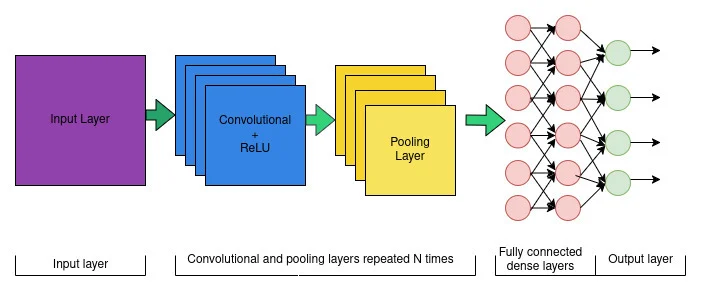

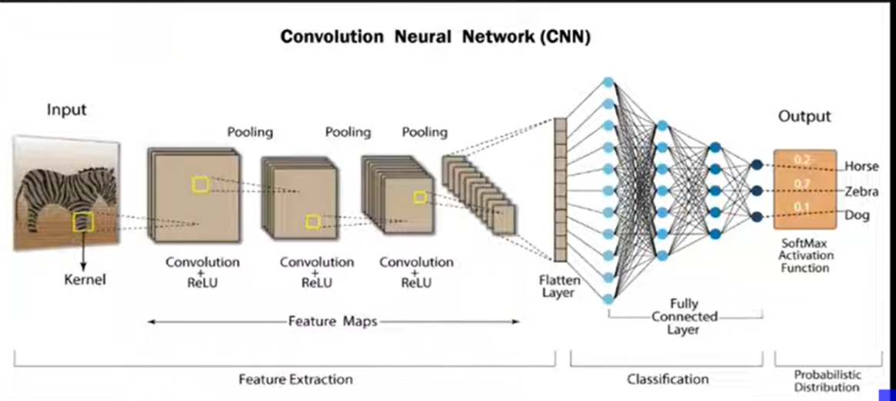