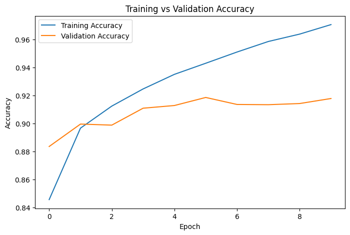
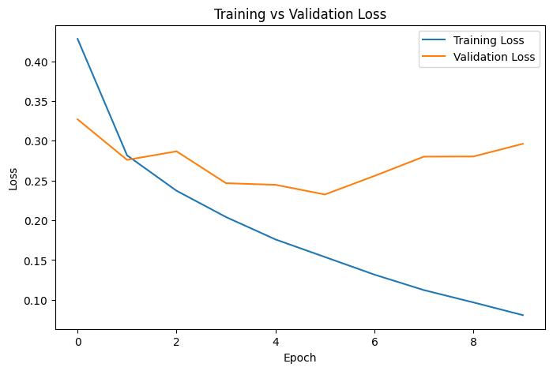
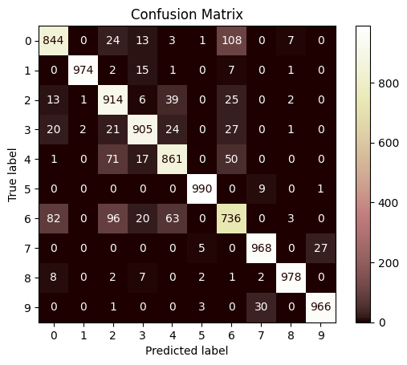

# Fashion MNIST Image Classifier using CNN

## Project Overview

This project implements a **Convolutional Neural Network (CNN)** to classify grayscale clothing images from the **Fashion MNIST** dataset. The dataset contains **70,000 images** (60,000 for training and 10,000 for testing) belonging to **10 clothing categories**. The model is built using **TensorFlow/Keras** and evaluated using multiple performance metrics.

---

# Why CNNs are Better than ANNs for Image Data

Although both Artificial Neural Networks (ANNs) and Convolutional Neural Networks (CNNs) can perform image classification, CNNs are specifically designed to process image data.

### Advantages of CNNs

- Preserve the spatial structure of images.
- Automatically learn important features such as edges, textures, and shapes.
- Require far fewer parameters than fully connected ANNs.
- Share weights through convolutional filters, reducing memory usage.
- More resistant to small translations and shifts in images.
- Achieve higher accuracy on image classification tasks.

In contrast, ANNs flatten images into one-dimensional vectors, causing the loss of spatial relationships between neighboring pixels and resulting in a much larger number of trainable parameters.

---

# Purpose of Convolution and Pooling Layers

## Convolution Layer

The convolution layer is responsible for extracting meaningful features from the input image using learnable filters (kernels).

Its main purposes are:

- Detect edges, corners, and textures.
- Learn increasingly complex features in deeper layers.
- Preserve the spatial arrangement of image pixels.
- Reduce the need for manual feature engineering.

---

## Pooling Layer

The pooling layer reduces the dimensions of feature maps while preserving the most important information.

Its main purposes are:

- Reduce computational cost.
- Reduce memory usage.
- Help prevent overfitting.
- Make learned features more robust to small translations in the image (translation invariance).

The model uses **Max Pooling**, which selects the maximum value from each pooling window.

---

# Model Architecture

The CNN architecture used in this project is:

```text
Input Image (28 × 28 × 1)
        │
        ▼
Conv2D
32 Filters
3 × 3 Kernel
Stride = 1
Padding = "same"
ReLU
        │
        ▼
MaxPooling2D
2 × 2
        │
        ▼
Conv2D
64 Filters
3 × 3 Kernel
Stride = 1
Padding = "same"
ReLU
        │
        ▼
MaxPooling2D
2 × 2
        │
        ▼
Flatten
        │
        ▼
Dense (128)
ReLU
        │
        ▼
Dense (64)
ReLU
        │
        ▼
Output Layer
10 Neurons
Softmax
```

---


# Model Performance

| **Metric** | **Accuracy** |
|------------|-------------:|
| Final Training Accuracy | **97.05%** |
| Final Validation Accuracy | **91.78%** |
| Test Accuracy | **91.00%** |


# Training Graphs


- Training Accuracy vs Validation Accuracy

- Training Loss vs Validation Loss

These graphs help visualize the learning progress and identify any signs of overfitting or underfitting.

---

# Confusion Matrix

The confusion matrix shows:

- Correct classifications along the diagonal.
- Misclassified images in the off-diagonal cells.
- Which clothing categories are most frequently confused with one another.

---

# Challenges Faced and How They Were Solved

| Challenge | Solution |
|-----------|----------|
| Choosing a suitable CNN architecture | Used two convolution layers, two max-pooling layers, and two dense layers to balance model complexity and performance. |
| Validation accuracy stopped improving after several epochs | Monitored the validation accuracy to identify mild overfitting while keeping the model architecture unchanged for this project. |

---

# Technologies Used

- Python
- TensorFlow
- Keras
- NumPy
- Matplotlib
- Scikit-learn

---

# Conclusion

The CNN successfully classified Fashion MNIST images with high accuracy. Compared to a traditional ANN, the CNN achieved better performance by automatically learning spatial features through convolution and reducing feature map dimensions using pooling. The model demonstrated strong generalization on unseen test images and effectively classified the ten clothing categories.