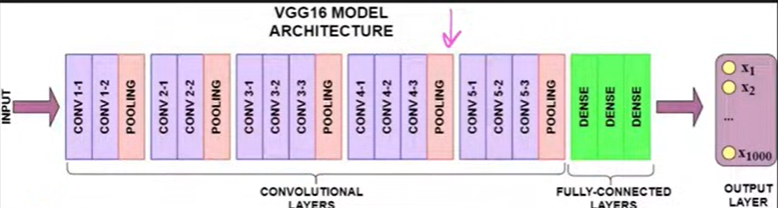

# Transfer Learning

Transfer Learning is a deep learning technique where a model trained on one large dataset is reused for a different but related task. Instead of training a neural network from scratch, we use the knowledge learned by a pre-trained model and adapt it to our own dataset.

---

# Why Not Train a Model from Scratch?

Training a deep learning model from scratch has several challenges:

- Requires a very large labeled dataset.
- Collecting and labeling data is expensive and time-consuming.
- Training takes a long time.
- Requires powerful GPUs or TPUs.
- High computational cost.

---

# What is a Pre-trained Model?

A **pre-trained model** is a neural network that has already been trained on a large dataset such as **ImageNet** (over 1 million images and 1000 classes).

Popular pre-trained models include:

- VGG16
- VGG19
- ResNet
- InceptionNet
- MobileNet
- EfficientNet



These models have already learned useful image features such as:

- Edges
- Corners
- Shapes
- Textures
- Objects

Instead of learning these features again, we reuse them.

---

# Why Use Transfer Learning?

Transfer Learning offers several benefits:

- Requires less training data.
- Reduces training time.
- Improves accuracy.
- Prevents overfitting.
- Saves computational resources.

---

# Example

Suppose a pre-trained model was trained on ImageNet.

Now you want to classify:

- Cats vs Dogs

Instead of training a new CNN, you can use the existing model and modify only the final classification layers.

---

# When is Transfer Learning Useful?

Transfer Learning is useful when:

- Your dataset is small.
- Your problem is similar to the original dataset.
- You need fast model development.
- You have limited computational resources.

---

# Basic Architecture of a Pre-trained CNN

A pre-trained CNN usually has two parts:

## 1. Convolutional Base

Responsible for extracting image features such as:

- Edges
- Corners
- Shapes
- Textures
- Patterns

This part already contains valuable learned knowledge.

---

## 2. Fully Connected (Dense) Layers

Responsible for:

- Classification
- Producing the final output

These layers are usually replaced with new layers according to your task.

---

# How Transfer Learning Works

Instead of using the entire pre-trained model:

1. Keep the convolutional base.
2. Remove the original dense layers.
3. Add new dense layers.
4. Train only the newly added layers.

The convolutional base keeps its learned knowledge while the new dense layers learn the new task.

---

# Why Does Transfer Learning Work?

CNN layers learn features gradually.

### Early Layers

Learn simple features like:

- Edges
- Lines
- Colors
- Corners

These features are common in almost every image.

---

### Middle Layers

Learn more meaningful patterns such as:

- Circles
- Shapes
- Textures

---

### Final Layers

Learn task-specific objects such as:

- Dogs
- Cats
- Cars
- Flowers

Since early features are general, we reuse them instead of learning them again.

---

# Two Approaches of Transfer Learning

## 1. Feature Extraction

In Feature Extraction:

- Keep the convolutional base.
- Freeze all convolutional layers.
- Replace the dense layers.
- Train only the new dense layers.

### When to Use

Use Feature Extraction when your dataset is similar to the dataset used to train the pre-trained model.

Example:

- Cats vs Dogs
- Horses vs Dogs
- Birds vs Animals

---

## 2. Fine-Tuning

In Fine-Tuning:

- Freeze early convolutional layers.
- Unfreeze the last few convolutional layers.
- Replace the dense layers.
- Train both the new dense layers and the last convolutional layers.

### When to Use

Use Fine-Tuning when your dataset is significantly different from the original dataset.

Example:

- Medical Images
- X-rays
- Satellite Images
- Industrial Defect Detection

---

# Feature Extraction vs Fine-Tuning

| Feature Extraction | Fine-Tuning |
|--------------------|------------|
| Freeze all convolution layers | Unfreeze last few convolution layers |
| Train only dense layers | Train dense layers + some convolution layers |
| Faster training | Slower training |
| Requires less data | Requires more data |
| Lower computational cost | Higher computational cost |
| Good for similar datasets | Good for different datasets |

---

# Freezing Layers

Freezing means:

- The weights of a layer are not updated during training.
- Previously learned knowledge is preserved.
- Training becomes faster.

In TensorFlow:

```python
base_model.trainable = False
```

---

# Unfreezing Layers

Unfreezing means:

- The weights of selected layers can be updated.
- The model adapts better to the new dataset.

Example:

```python
base_model.trainable = True
```

or unfreeze only the last few layers.

---

# Data Normalization

Before training, pixel values are usually scaled.

Original range:

```
0 - 255
```

Normalized range:

```
0 - 1
```

Example:

```python
image = image / 255.0
```

Normalization:

- Speeds up training.
- Improves convergence.
- Makes optimization easier.

---

# Data Augmentation

Data Augmentation creates new training images by applying random transformations.

Examples:

- Rotation
- Zoom
- Flip
- Shift
- Shear
- Brightness changes

Benefits:

- Increases dataset size.
- Reduces overfitting.
- Improves model generalization.

---

# Optimizer Used

Common optimizers include:

- Adam
- RMSprop
- SGD

For Fine-Tuning, a small learning rate is usually preferred because only a few layers are being updated.

---

# Loss Functions

### Binary Classification

Use:

```python
Binary Crossentropy
```

Examples:

- Cats vs Dogs
- Real vs Fake

---

### Multi-Class Classification

Use:

```python
Categorical Crossentropy
```

or

```python
Sparse Categorical Crossentropy
```

Examples:

- Fashion MNIST
- CIFAR-10
- ImageNet

---

# Performance Improvements

Typical observations:

- Training a CNN from scratch may achieve around **80–82% accuracy**.
- Feature Extraction can improve accuracy to around **90%**.
- Fine-Tuning can further improve accuracy to around **95%** (depending on the dataset).

---

# Advantages of Transfer Learning

- Requires less data.
- Faster training.
- Better accuracy.
- Less computational cost.
- Reduces overfitting.
- Easy to implement.
- Widely used in computer vision.

---

# Limitations of Transfer Learning

- Not suitable if the new dataset is completely unrelated.
- Fine-Tuning requires careful selection of layers.
- Large pre-trained models consume significant memory.
- Performance depends on the quality of the pre-trained model.

---

# Summary

Transfer Learning allows us to reuse the knowledge of a model trained on a large dataset. Instead of training from scratch, we keep the learned feature extractor and adapt the model to a new task. The two main approaches are **Feature Extraction** and **Fine-Tuning**, both of which significantly reduce training time while improving performance on smaller datasets.