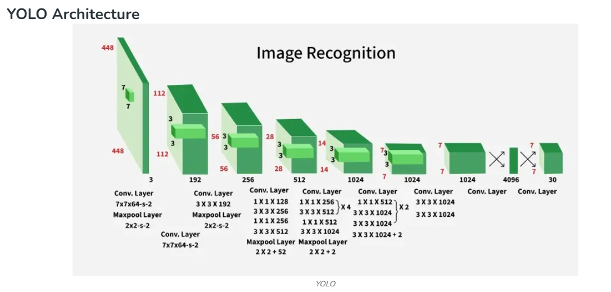
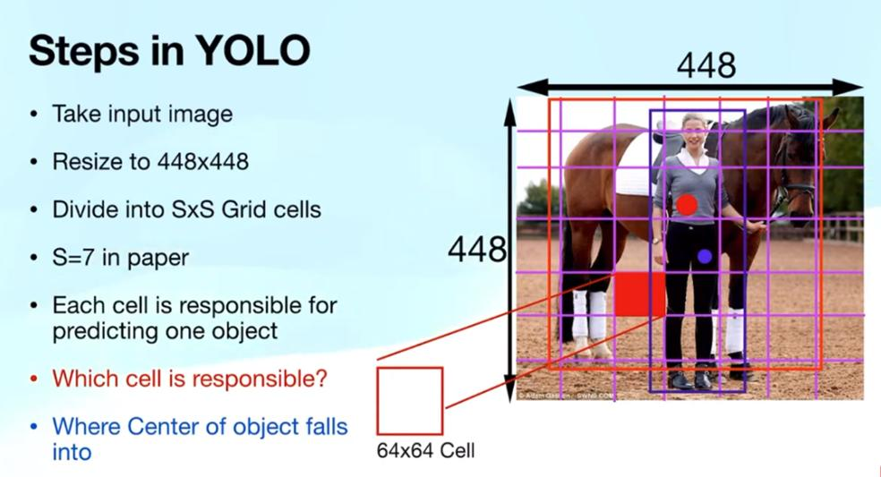
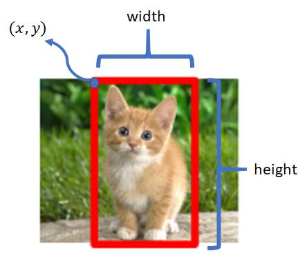

# Object Detection

## What is Object Detection?

**Object Detection** is a computer vision technique that identifies **what objects are present in an image** and **where they are located**.

Unlike image classification, object detection can detect **multiple objects** in a single image and draw a **bounding box** around each detected object.

### Example

Image:
- Dog
- Cat
- Car

Object Detection Output:
- Dog → Bounding Box + Confidence Score
- Cat → Bounding Box + Confidence Score
- Car → Bounding Box + Confidence Score

---

# Image Classification vs Object Detection

| Image Classification | Object Detection |
|-----------------------|------------------|
| Identifies what object is in an image. | Identifies what objects are present and where they are located. |
| Predicts only one label for the whole image (or multi-label in some cases). | Predicts multiple objects in one image. |
| Does not provide object locations. | Provides the location using bounding boxes. |
| Simpler task. | More complex task. |
| Output: Class label | Output: Bounding Box + Class Label + Confidence Score |

### Example

Suppose an image contains a **cat sitting on a chair**.

**Image Classification**
```
Prediction:
Cat
```

**Object Detection**
```
Cat      → Bounding Box
Chair    → Bounding Box
```

---

# Bounding Boxes

A **Bounding Box** is a rectangular box drawn around an object to indicate its location within an image.

It helps the model determine **where the object is positioned**.

### Bounding Box Information

A bounding box is usually represented by:

- x-coordinate
- y-coordinate
- Width
- Height

or

- (x_min, y_min)
- (x_max, y_max)


---

# Class Labels

A **Class Label** is the name of the detected object.

Examples include:

- Cat
- Dog
- Person
- Car
- Bicycle
- Bus
- Laptop

### Example

```
Object:
Class Label:
Dog
```

If multiple objects exist:

```
Dog
Cat
Car
Person
```

Each detected object receives its own class label.

---

# Confidence Score

A **Confidence Score** represents how confident the model is that the detected object belongs to a particular class.

It is expressed as a value between **0 and 1** or as a **percentage (0%–100%)**.

### Example

| Detected Object | Confidence Score |
|-----------------|------------------|
| Dog | 98% |
| Cat | 95% |
| Car | 91% |
| Person | 87% |

Higher confidence indicates that the model is more certain about its prediction.

Example output:

```
Dog (98%)

Cat (95%)

Car (91%)
```

---

# Real-World Applications of Object Detection

Object Detection is widely used in many industries.

## 1. Autonomous Vehicles

- Detect cars
- Detect pedestrians
- Detect traffic lights
- Detect road signs
- Avoid collisions

---

## 2. Face Detection

- Unlock smartphones
- Attendance systems
- Face recognition
- Security verification

---

## 3. Medical Imaging

- Detect tumors
- Detect cancer cells
- Identify fractures
- Analyze X-rays
- Analyze MRI scans

---

## 4. Security and Surveillance

- Detect suspicious activities
- Identify intruders
- Monitor public places
- Detect unattended objects

---

## 5. Retail Stores

- Inventory management
- Product counting
- Automated checkout
- Shelf monitoring

---

## 6. Agriculture

- Detect diseases in crops
- Count fruits
- Detect weeds
- Monitor livestock

---

## 7. Manufacturing

- Detect defective products
- Quality inspection
- Assembly line monitoring
- Robot guidance

---

## 8. Sports Analytics

- Track players
- Detect the ball
- Analyze player movements
- Generate match statistics

---

## 9. Wildlife Monitoring

- Detect animals
- Count species
- Monitor endangered wildlife
- Forest surveillance

---

https://www.geeksforgeeks.org/machine-learning/yolo-you-only-look-once-real-time-object-detection/

# YOLO (You Only Look Once) – Real-Time Object Detection


## What is YOLO?

**YOLO (You Only Look Once)** is a **deep learning-based object detection algorithm** that detects and localizes objects in an image using **a single forward pass** through a neural network.

Unlike traditional object detection methods that first generate object proposals and then classify them, YOLO performs **object localization and classification simultaneously**, making it one of the fastest object detection algorithms.

### Key Features

- Detects multiple objects in a single image.
- Predicts object classes and bounding boxes simultaneously.
- Performs detection in real time.
- Offers an excellent balance between speed and accuracy.

---

# YOLO Architecture

The original YOLO architecture consists of several stages:



## 1. Input Preprocessing

Before passing the image to the network:

- Image is resized to **448 × 448 pixels**
- Aspect ratio is preserved using padding if necessary
- Produces a fixed-size input for the neural network

```
Original Image
        │
        ▼
Resize to 448 × 448
        │
        ▼
Input to CNN
```

---

## 2. Backbone Convolutional Neural Network (CNN)

The resized image passes through a deep CNN responsible for extracting image features.

Original YOLO uses:

- **24 Convolutional Layers**
- **4 Max-Pooling Layers**

These layers learn:

- Edges
- Shapes
- Textures
- Object parts
- High-level semantic features

```
Input Image
      │
      ▼
Convolution Layers
      │
      ▼
Feature Maps
```

---

## 3. Convolutional Layers

YOLO combines two types of convolutions:

### 1 × 1 Convolution

Used for:

- Reducing the number of channels
- Lower computation
- Faster processing

### 3 × 3 Convolution

Used for:

- Capturing spatial information
- Detecting edges and object structures

Pattern used:

```
1 × 1 Conv
      │
      ▼
3 × 3 Conv
```

This combination improves efficiency without sacrificing accuracy.

---

## 4. Fully Connected Layers

After feature extraction:

- Feature maps are flattened.
- Passed through **2 Fully Connected (Dense) Layers**.

The final layer outputs a vector of:

```
(1, 1470)
```

---

## 5. Cuboidal Prediction Output

The output vector is reshaped into:

```
(7 × 7 × 30)
```

Meaning:

- **7 × 7** → Image divided into **49 grid cells**
- **30 values** predicted for each grid cell

Each grid cell predicts:

```
30 =
(2 Bounding Boxes × 5 values)
+
20 Class Probabilities
```

or

```
30 = (2 × 5) + 20
```

Where each bounding box contains:

```
x
y
width
height
confidence score
```

---

## 6. Activation Function

YOLO mainly uses **Leaky ReLU** activation.


### Advantages

- Prevents dead neurons.
- Allows a small gradient for negative values.
- Improves convergence during training.

---

## 7. Output Layer Activation

The final layer uses a **Linear Activation Function** because the network predicts:

- Bounding box coordinates
- Confidence scores
- Class probabilities

These values are continuous and should not be restricted.

---

## 8. Regularization Techniques

### Batch Normalization

- Faster training
- Stable gradients
- Better convergence

### Dropout

- Reduces overfitting
- Improves model generalization

---

# YOLO Training Process

## 1. Dataset and Training

Original YOLO is first pretrained on:

- **ImageNet-1000**

After feature learning, it is fine-tuned for object detection.

A smaller version called **Fast YOLO** uses:

- Fewer convolution layers
- Fewer filters
- Faster inference
- Slightly lower accuracy

---

## 2. YOLO Loss Function

YOLO uses a **Sum-Squared Error Loss** that jointly optimizes:

- Localization
- Confidence
- Classification

The loss contains three main parts:

1. Localization Loss
2. Confidence Loss
3. Classification Loss

---

## 3. Localization Loss

Measures how accurately the predicted bounding box matches the true object.

It compares:

- x-coordinate
- y-coordinate
- width
- height

YOLO predicts:

```
Predicted Box

(x, y, w, h)
```

Ground Truth:

```
Actual Box

(x, y, w, h)
```

Smaller objects receive greater importance by applying the square root to width and height.

---

## 4. Classification Loss

Measures whether the predicted object belongs to the correct class.

It evaluates:

- Confidence score error
- No-object confidence error
- Class prediction error

This helps YOLO learn:

- Where objects are
- Whether an object exists
- What the object is

---

# Object Detection Using YOLO

## 1. Grid-Based Detection

YOLO divides the image into an **S × S grid**.

Original YOLO:

```
7 × 7 Grid
```

```
+----+----+----+----+----+----+----+
|    |    |    |    |    |    |    |
+----+----+----+----+----+----+----+
|    |    |    |    |    |    |    |
+----+----+----+----+----+----+----+
|    |    |    |    |    |    |    |
+----+----+----+----+----+----+----+
|    |    |    |    |    |    |    |
+----+----+----+----+----+----+----+
|    |    |    |    |    |    |    |
+----+----+----+----+----+----+----+
|    |    |    |    |    |    |    |
+----+----+----+----+----+----+----+
|    |    |    |    |    |    |    |
+----+----+----+----+----+----+----+
```

Each grid cell is responsible for detecting objects whose **center lies inside that cell**.

---



## 2. Bounding Box Prediction

Each predicted bounding box contains **5 values**:

| Parameter | Meaning |
|-----------|---------|
| x | Center x-coordinate |
| y | Center y-coordinate |
| w | Width |
| h | Height |
| Confidence | Object confidence |

Example:

```
Bounding Box

x = 0.45
y = 0.60
w = 0.20
h = 0.30
Confidence = 0.95
```

---

## 3. Confidence Score

Confidence Score is computed as:

```
Confidence

= P(Object) × IoU
```

Where:

- **P(Object)** → Probability that an object exists.
- **IoU (Intersection over Union)** → Measures the overlap between the predicted box and the ground-truth box.

Higher IoU indicates better localization.

---

## 4. Class Probability Prediction

Each grid cell predicts conditional class probabilities:

```
P(Class | Object)
```

For example:

```
Dog      → 0.90
Cat      → 0.05
Person   → 0.03
Car      → 0.02
```

The prediction tensor has the shape:

```
S × S × (5B + C)
```

Where:

- **S** = Grid size
- **B** = Number of bounding boxes per grid cell
- **C** = Number of object classes

---

## 5. Final Detection Output

YOLO combines:

```
Class Probability
        ×
Confidence Score
```

to obtain **class-specific confidence scores**.

Since multiple bounding boxes may overlap, YOLO applies **Non-Maximum Suppression (NMS)**.

### Non-Maximum Suppression (NMS)

NMS:

- Removes duplicate bounding boxes.
- Keeps only the box with the highest confidence.
- Produces the final detection results.

Example:

Before NMS

```
Dog (95%)
Dog (92%)
Dog (87%)
```

After NMS

```
Dog (95%)
```

---

# Advantages (Importance) of YOLO

### 1. Real-Time Detection

- Detects objects in a single forward pass.
- Suitable for live video and surveillance.

---

### 2. End-to-End Learning

A single neural network performs:

- Feature extraction
- Object localization
- Object classification

No separate stages are required.

---

### 3. Global Image Understanding

YOLO analyzes the **entire image** instead of small regions, reducing background errors and improving context awareness.

---

### 4. High Efficiency

Compared with traditional two-stage detectors:

- Faster inference
- Lower computational cost
- Suitable for edge devices and embedded systems

---

# Applications of YOLO

-  Autonomous Vehicles
-  Video Surveillance
-  Face Detection
-  Medical Image Analysis
-  Retail Product Detection
-  Smart Agriculture
-  Industrial Quality Inspection
-  Sports Analytics
-  Robotics
-  Wildlife Monitoring

