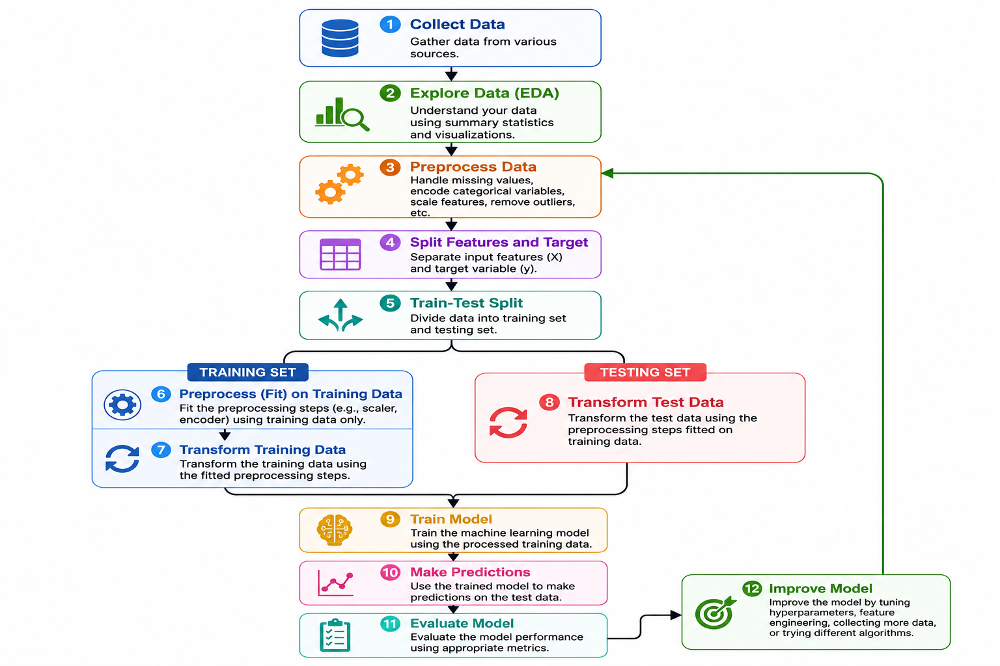

# Machine Learning Workflow

A **Machine Learning Workflow** is a step-by-step process used to build, train, and evaluate a machine learning model. Following a structured workflow helps create accurate and reliable models.

---

## Step 1: Collect Data

Gather the data needed to solve the problem. The data can come from:

- CSV or Excel files
- Databases
- APIs
- Web scraping
- Sensors or user input

Example:

```python
import pandas as pd

df = pd.read_csv("data.csv")
```

---

## Step 2: Explore the Data

Understand the dataset by checking:

- Shape of the data
- Data types
- Missing values
- Summary statistics
- Class distribution

Example:

```python
print(df.head())
print(df.info())
print(df.describe())
```

---

## Step 3: Preprocess the Data

Clean and prepare the data before training the model.

Common preprocessing tasks include:

- Handling missing values
- Removing duplicates
- Encoding categorical variables
- Feature scaling
- Feature selection

Example:

```python
from sklearn.preprocessing import StandardScaler

scaler = StandardScaler()

X_scaled = scaler.fit_transform(X_train)
```

> **Note:** Always perform preprocessing that learns from the data (such as scaling) **after** the train-test split to avoid data leakage.

---

## Step 4: Separate Features and Target

Split the dataset into:

- **Features (X):** Input variables
- **Target (y):** Output variable

Example:

```python
X = df.drop("target", axis=1)
y = df["target"]
```

---

## Step 5: Split the Dataset

Divide the data into training and testing sets.

- Training Set → Used to train the model
- Testing Set → Used to evaluate the model

Example:

```python
from sklearn.model_selection import train_test_split

X_train, X_test, y_train, y_test = train_test_split(
    X,
    y,
    test_size=0.2,
    random_state=42
)
```

---

## Step 6: Train the Model

Choose a machine learning algorithm and train it using the training data.

Example:

```python
from sklearn.linear_model import LogisticRegression

model = LogisticRegression()

model.fit(X_train, y_train)
```

---

## Step 7: Make Predictions

Use the trained model to predict the target values for the test data.

Example:

```python
y_pred = model.predict(X_test)

print(y_pred)
```

---

## Step 8: Evaluate the Model

Measure the model's performance using evaluation metrics.

Common metrics:

- Accuracy
- Precision
- Recall
- F1-Score
- Mean Squared Error (Regression)

Example:

```python
from sklearn.metrics import accuracy_score

accuracy = accuracy_score(y_test, y_pred)

print("Accuracy:", accuracy)
```

---

## Step 9: Improve the Model (Optional)

Improve model performance by:

- Hyperparameter tuning
- Feature engineering
- Trying different algorithms
- Collecting more data
- Cross-validation

Example:

```python
from sklearn.model_selection import GridSearchCV

grid = GridSearchCV(model, param_grid, cv=5)

grid.fit(X_train, y_train)
```

---

# Machine Learning Workflow Diagram


