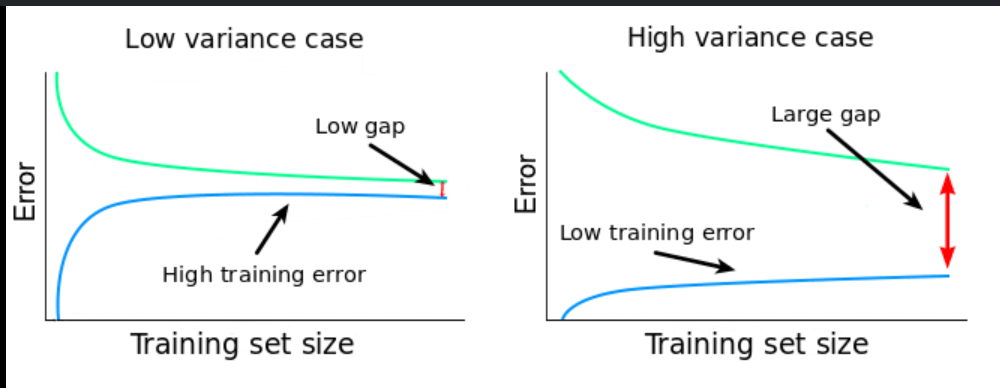
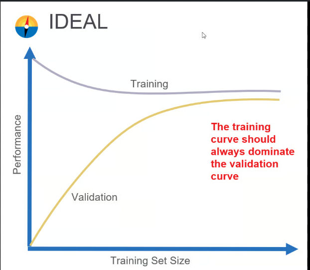
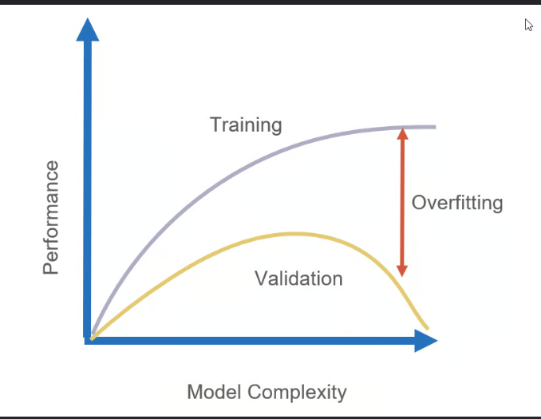
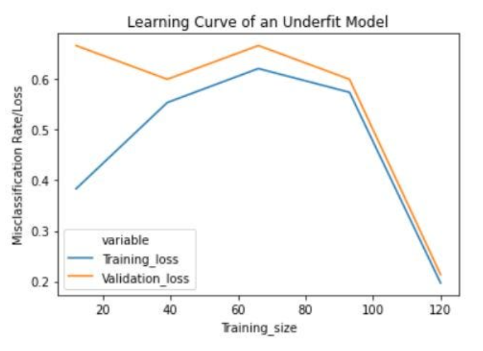

# Learning Curve

## What is a Learning Curve?

A **Learning Curve** is a graphical representation that shows how a machine learning model's performance changes as the amount of **training data** increases.

It helps us understand:

- Whether the model is learning effectively.
- Whether the model is overfitting or underfitting.
- Whether adding more training data is likely to improve performance.

A learning curve plots the model's performance on both the **training dataset** and the **validation (or testing) dataset**.

---

# Axes of a Learning Curve

- **X-axis:** Number of Training Examples
- **Y-axis:** Model Performance (Accuracy, F1-Score, Error, etc.)

```
Performance
 ^
 |
 |      Training Score
 |      **************
 |     *            *
 |    *              *
 |   *                *
 |  *                  *
 | *                    *
 |*                      ******** Validation Score
 +-----------------------------------------------> Number of Training Examples
```

As more training examples are added:

- The **training score** usually decreases slightly.
- The **validation score** usually increases.
- Eventually, both curves stabilize.

---

# Why are Learning Curves Important?

Learning curves help us:

- Evaluate model performance.
- Detect overfitting.
- Detect underfitting.
- Decide whether collecting more data will improve the model.
- Compare different machine learning models.

---



# Components of a Learning Curve

A learning curve contains two lines:

## 1. Training Score

The performance of the model on the **training dataset**.

Characteristics:

- Usually starts very high.
- May decrease slightly as more training data is added.

---

## 2. Validation Score

The performance of the model on **unseen validation or testing data**.

Characteristics:

- Usually starts low.
- Improves as more training data becomes available.
- Eventually stabilizes.

---

# Types of Learning Curves

## 1. Good Fit

The training and validation curves are both high and close to each other.


### Characteristics

- High training performance.
- High validation performance.
- Small gap between the curves.
- Model generalizes well.

---

## 2. Overfitting

The training score is very high, but the validation score remains much lower.


### Characteristics

- Very high training performance.
- Low validation performance.
- Large gap between the two curves.
- Model memorizes the training data instead of learning general patterns.

### How to Reduce Overfitting

- Collect more training data.
- Reduce model complexity.
- Apply regularization.
- Use feature selection.
- Use cross-validation.
- Apply early stopping (for iterative models).

---

## 3. Underfitting

Both training and validation scores remain low.

``

### Characteristics

- Low training performance.
- Low validation performance.
- Both curves are close together.
- Model is too simple to learn the data.

### How to Reduce Underfitting

- Increase model complexity.
- Add more relevant features.
- Train the model longer (if applicable)
- Reduce excessive regularization.

---

# Comparison of Learning Curves

| Learning Curve | Training Score | Validation Score | Gap | Interpretation |
|----------------|---------------:|-----------------:|-----|----------------|
| Good Fit | High | High | Small | Model generalizes well. |
| Overfitting | Very High | Low | Large | Model memorizes the training data. |
| Underfitting | Low | Low | Small | Model is too simple to learn the patterns. |

---

# Advantages of Learning Curves

- Help evaluate model performance.
- Detect overfitting and underfitting.
- Show whether additional training data is beneficial.
- Help compare machine learning models.
- Assist in selecting the appropriate model complexity.

---

# Limitations of Learning Curves

- Can be computationally expensive for large datasets.
- Require repeated model training with different training set sizes.
- Interpretation may be difficult for very complex models.

---

