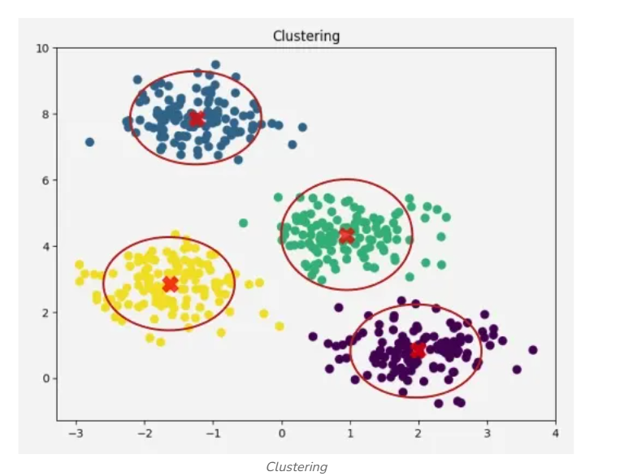
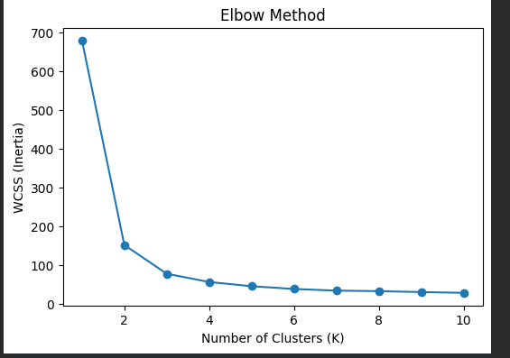

https://www.geeksforgeeks.org/machine-learning/unsupervised-learning/


What is Unsupervised Learning? 

What is Clustering?

K-Means Clustering .... Slides

Choosing the value of K ... Slides

Elbow Method ... Slides

Cluster Visualization

Real-world applications of clustering

# Unsupervised Machine Learning

## What is Unsupervised Machine Learning?

Unsupervised Learning is a type of **machine learning** in which the model is trained using **unlabeled data**. Unlike supervised learning, the algorithm is not provided with the correct output labels. Instead, it learns by identifying hidden patterns, relationships, or structures within the data on its own.

It is commonly used for:

- Clustering
- Dimensionality Reduction
- Association Rule Learning

### Key Characteristics

- Uses **unlabeled data**.
- Discovers hidden patterns and relationships.
- Groups similar data points automatically.
- Useful for data exploration and pattern discovery.
- Can detect anomalies and reduce data complexity.

---

# How Unsupervised Learning Works

The working of an unsupervised learning algorithm can be explained in the following steps.

## Step 1: Collect Unlabeled Data

The process begins by collecting a dataset that does not contain predefined output labels.

**Example:**

A collection of animal images without labels such as elephant, camel, or cow.

---

## Step 2: Select an Algorithm

Choose an appropriate unsupervised learning algorithm depending on the objective.

Examples include:

- K-Means (Clustering)
- DBSCAN (Density-Based Clustering)
- Apriori (Association Rule Learning)
- PCA (Dimensionality Reduction)

---

## Step 3: Train the Model

The unlabeled dataset is provided to the algorithm.

The algorithm analyzes the data and searches for:

- Similarities
- Relationships
- Hidden structures
- Patterns

No human guidance or labels are provided during training.

---

## Step 4: Group or Transform Data

Based on the discovered patterns, the algorithm:

- Groups similar data into clusters.
- Finds relationships between items.
- Reduces the number of features while preserving important information.

---

## Step 5: Interpret the Results

The discovered clusters, rules, or transformed features are analyzed and used for:

- Business insights
- Data visualization
- Recommendation systems
- Anomaly detection
- Further machine learning tasks

---

# Types of Unsupervised Learning Algorithms

There are three main categories of unsupervised learning algorithms.

---

# 1. Clustering Algorithms

Clustering groups similar data points into clusters based on their characteristics.

### Characteristics

- Groups similar data points together.
- Discovers natural groupings.
- Does not require labeled data.
- Useful for data exploration.

### Common Clustering Algorithms

### K-Means Clustering

Groups data into **K clusters** by assigning each data point to the nearest centroid.

---

### Hierarchical Clustering

Builds clusters by continuously merging or splitting groups of data.

---

### DBSCAN

Groups dense regions of data together and labels isolated points as noise.

---

### Mean Shift

Finds clusters by moving data points toward areas with the highest density.

---

### Spectral Clustering

Uses graph theory to cluster data based on relationships between data points.

---

### Applications

- Customer segmentation
- Image clustering
- Document clustering
- Anomaly detection

---

# 2. Association Rule Learning

Association Rule Learning discovers interesting relationships between variables in large datasets.

It generates rules in the form:

```
If A occurs
↓

B is also likely to occur.
```

### Characteristics

- Finds frequent item combinations.
- Discovers hidden relationships.
- Generates "If-Then" rules.
- Popular in retail and e-commerce.

### Common Algorithms

### Apriori Algorithm

Finds frequent itemsets step by step and generates association rules.

---

### FP-Growth Algorithm

A faster alternative to Apriori that avoids generating candidate itemsets.

---

### Eclat Algorithm

Uses set intersections to efficiently discover frequent itemsets.

---

### Efficient Tree-Based Algorithms

Use tree structures to efficiently process very large datasets.

---

### Applications

- Market Basket Analysis
- Product Recommendations
- Cross-selling
- Store Layout Optimization

---

# 3. Dimensionality Reduction

Dimensionality Reduction reduces the number of features while preserving as much useful information as possible.

### Characteristics

- Reduces the number of variables.
- Removes redundant information.
- Simplifies datasets.
- Improves computational efficiency.
- Helps reduce overfitting.

### Common Algorithms

### Principal Component Analysis (PCA)

Transforms correlated features into fewer uncorrelated principal components.

---

### Non-negative Matrix Factorization (NMF)

Represents data using non-negative components for easier interpretation.

---

### Locally Linear Embedding (LLE)

Reduces dimensions while preserving relationships between nearby points.

---

### Isomap

Preserves the global geometric structure of high-dimensional data.

---

### Applications

- Data Visualization
- Image Compression
- Noise Reduction
- Feature Extraction

---

# Applications of Unsupervised Learning

## Customer Segmentation

Groups customers with similar purchasing behavior or demographics for targeted marketing.

---

## Anomaly Detection

Identifies unusual patterns in data for:

- Fraud Detection
- Cybersecurity
- Equipment Failure Detection

---

## Recommendation Systems

Suggests products, movies, or music based on user behavior and preferences.

Examples include:

- Netflix
- Amazon
- Spotify

---

## Image and Text Clustering

Groups similar images or documents for easier organization and retrieval.

---

## Social Network Analysis

Identifies communities, influencers, and interaction patterns within social networks.

---

# Advantages of Unsupervised Learning

- Works with unlabeled data.
- Eliminates the need for manual labeling.
- Discovers hidden patterns automatically.
- Handles large and high-dimensional datasets.
- Detects anomalies effectively.
- Useful for exploratory data analysis.

---

# Challenges of Unsupervised Learning

- Sensitive to noisy data and outliers.
- Difficult to evaluate because there are no true labels.
- Results may be difficult to interpret.
- Algorithms may detect meaningless patterns.
- Selecting the appropriate algorithm and parameters can be challenging.

---

https://www.geeksforgeeks.org/machine-learning/clustering-in-machine-learning/

# Clustering in Machine Learning

## What is Clustering?

Clustering is an **unsupervised machine learning** technique used to group similar data points together **without using labeled data**. The goal is to discover hidden patterns or natural groupings in a dataset by placing similar data points into the same cluster.


### Key Characteristics

- Uses **unlabeled data**.
- Discovers hidden patterns or structures.
- Groups similar data points into clusters.
- Uses similarity or distance measures such as:
  - Euclidean Distance
  - Manhattan Distance
  - Cosine Similarity
  - Minkowski Distance (depending on the algorithm)

---

# Types of Clustering

## 1. Hard Clustering

Hard clustering assigns **each data point to exactly one cluster**. A data point cannot belong to more than one cluster.

### Characteristics

- Each data point belongs to only one cluster.
- No overlap between clusters.
- Simple and easy to interpret.

### Example

Suppose customers are divided into two clusters.

```
Customer A → Cluster 1
Customer B → Cluster 2
Customer C → Cluster 1
```

Each customer belongs to only one cluster.

### Applications

- Market segmentation
- Customer grouping
- Document clustering

### Limitation

A data point cannot belong to multiple groups even if it shares characteristics with them.

---

## 2. Soft Clustering

Soft clustering allows a data point to belong to **multiple clusters** with different probabilities.

### Characteristics

- One data point can belong to multiple clusters.
- Each cluster has a membership probability.
- Better for overlapping data.

### Example

```
Customer A

Cluster 1 → 70%
Cluster 2 → 30%
```

The customer shares characteristics with both clusters.

### Applications

- Customer personas
- Medical diagnosis
- Overlapping class boundaries

### Advantages

- Represents uncertainty.
- Handles overlapping clusters.
- Models gradual transitions between groups.

---

# Clustering Methods

## 1. Centroid-Based Clustering

Centroid-based clustering groups data points around a central point called a **centroid** (or **medoid**).

Each data point is assigned to the nearest centroid.

### Algorithms

### K-Means

- Uses the mean of the cluster as the centroid.
- Updates centroids iteratively until convergence.

### K-Medoids

- Uses an actual data point as the cluster center.
- More robust to outliers than K-Means.

### Advantages

- Fast and scalable.
- Easy to implement.
- Works well for large datasets.

### Limitations

- Number of clusters (K) must be chosen beforehand.
- Sensitive to outliers.
- Works best with spherical clusters.

---

## 2. Density-Based Clustering

Density-based clustering forms clusters where data points are densely packed together. Sparse regions are treated as noise.

### Algorithms

### DBSCAN

- Finds dense regions.
- Detects noise automatically.

### OPTICS

- Extension of DBSCAN.
- Handles varying densities better.

### Advantages

- Detects clusters of different shapes.
- Automatically detects noise.
- Does not require specifying the number of clusters.

### Limitations

- Choosing parameters can be difficult.
- DBSCAN struggles when cluster densities vary significantly.

---

## 3. Connectivity-Based (Hierarchical) Clustering

Hierarchical clustering builds a hierarchy of clusters and represents it as a **Dendrogram**.

### Types

### Agglomerative Clustering (Bottom-Up)

- Start with every point as its own cluster.
- Merge the closest clusters step by step.
- Continue until only one cluster remains.

```
A   B   C   D

↓

AB   C   D

↓

ABC   D

↓

ABCD
```

---

### Divisive Clustering (Top-Down)

- Start with one large cluster.
- Split it into smaller clusters repeatedly.

```
ABCD

↓

ABC   D

↓

AB   C   D

↓

A   B   C   D
```

### Advantages

- Easy to visualize using a dendrogram.
- No need to specify the number of clusters initially.

### Limitations

- Slow for large datasets.
- Merge/split decisions cannot be undone.

---

## 4. Distribution-Based Clustering

Distribution-based clustering assumes the data is generated from a mixture of probability distributions.

Each cluster is represented by a statistical distribution.

### Algorithm

### Gaussian Mixture Model (GMM)

- Models each cluster as a Gaussian (Normal) distribution.
- Assigns probabilities that each point belongs to each cluster.

### Advantages

- Handles overlapping clusters.
- Produces probabilistic memberships.
- Can model elliptical clusters.

### Limitations

- Requires specifying the number of clusters.
- More computationally expensive.
- Sensitive to initialization.

---

## 5. Fuzzy Clustering

Fuzzy clustering allows every data point to belong to multiple clusters with different degrees of membership.

### Algorithm

### Fuzzy C-Means

Similar to K-Means but instead of assigning a point completely to one cluster, it assigns a membership value.

### Example

```
Point A

Cluster 1 → 0.80

Cluster 2 → 0.20
```

### Advantages

- Represents uncertainty.
- Handles overlapping clusters.
- Useful for complex datasets.

### Limitations

- Choosing the fuzziness parameter can be difficult.
- Slightly slower than K-Means.

---

# Hard Clustering vs Soft Clustering

| Feature | Hard Clustering | Soft Clustering |
|---------|-----------------|-----------------|
| Cluster Membership | Only one cluster | Multiple clusters |
| Probability | No | Yes |
| Overlapping Groups | Not Allowed | Allowed |
| Interpretation | Simple | More Flexible |
| Example Algorithms | K-Means | Gaussian Mixture Model, Fuzzy C-Means |

---

# Comparison of Clustering Methods

| Method | Example Algorithm | Cluster Shape | Handles Noise | Need Number of Clusters |
|---------|-------------------|---------------|---------------|-------------------------|
| Centroid-Based | K-Means | Spherical | No | Yes |
| Density-Based | DBSCAN | Any Shape | Yes | No |
| Connectivity-Based | Hierarchical | Any Shape | Limited | No |
| Distribution-Based | GMM | Elliptical | Moderate | Yes |
| Fuzzy Clustering | Fuzzy C-Means | Overlapping | Moderate | Yes |

---

# Applications of Clustering

## Customer Segmentation

Groups customers based on purchasing behavior or demographics for targeted marketing.

---

## Anomaly Detection

Identifies unusual or abnormal patterns in:

- Banking
- Cybersecurity
- Fraud Detection
- Sensor Networks

---

## Image Segmentation

Divides an image into meaningful regions for computer vision tasks.

---

## Recommendation Systems

Groups similar users or products to generate personalized recommendations.

Examples:

- Netflix
- Amazon
- Spotify

---

## Market Basket Analysis

Identifies products that are frequently purchased together.

Example:

```
Bread → Butter
Milk → Eggs
Laptop → Mouse
```

This information helps businesses improve product placement and recommendation systems.

---

# Principal Component Analysis (PCA)

## What is PCA?

Principal Component Analysis (PCA) is an **unsupervised dimensionality reduction** technique used to reduce the number of features (dimensions) in a dataset while preserving as much important information (variance) as possible.

Instead of removing features randomly, PCA creates **new features**, called **Principal Components (PCs)**, which are combinations of the original features.

The goal of PCA is to simplify the dataset while retaining most of the useful information.

---

# Why Do We Need PCA?

Real-world datasets often contain:

- Too many features
- Correlated features
- Redundant information
- High computational cost
- Difficulty in visualization

PCA helps solve these problems by reducing the number of features.

### Benefits

- Reduces dimensionality
- Speeds up model training
- Removes redundant information
- Reduces noise
- Helps reduce overfitting
- Makes visualization easier

---

# Example

Suppose a student dataset contains:

| Height | Weight | BMI | Age | Marks |
|---------|--------|-----|-----|-------|

Notice that:

- Height and Weight influence BMI.
- These features are highly correlated.

Instead of keeping all three features, PCA may combine them into one principal component that captures most of the information.

Original Features

```
Height
Weight
BMI
Age
Marks
```

↓

After PCA

```
PC1
PC2
PC3
```

Now instead of 5 features, we have only 3 principal components.

---

# What are Principal Components?

Principal Components are **new variables** created from the original features.

They:

- Are linear combinations of original features.
- Are uncorrelated with each other.
- Capture maximum variance.

The components are ordered according to the amount of information they preserve.

```
PC1 → Maximum information

PC2 → Second highest information

PC3 → Third highest information
```

---

# How PCA Works

## Step 1: Standardize the Data

Features may have different scales.

Example:

```
Age = 25

Salary = 80000
```

Large-scale features dominate the calculations.

Therefore, PCA first standardizes the data using StandardScaler.

---

## Step 2: Calculate the Covariance Matrix

PCA measures how features vary together.

If two features change together,

they are highly correlated.

Example:

```
Height ↑

Weight ↑
```

High covariance.

---

## Step 3: Compute Eigenvalues and Eigenvectors

PCA calculates:

### Eigenvectors

Represent the directions of maximum variance.

These become the Principal Components.

### Eigenvalues

Measure how much information (variance) each principal component contains.

Higher Eigenvalue

↓

More important component

---

## Step 4: Sort Components

Components are sorted according to their Eigenvalues.

Example:

| Component | Variance Explained |
|-----------|-------------------:|
| PC1 | 70% |
| PC2 | 20% |
| PC3 | 8% |
| PC4 | 2% |

---

## Step 5: Select Top Components

Choose the components that preserve most of the information.

Example

```
PC1 = 70%

PC2 = 20%
```

Total

```
70 + 20 = 90%
```

We can discard the remaining components.

---

## Step 6: Transform the Data

The original features are transformed into Principal Components.

Original

```
30 Features
```

↓

PCA

```
10 Principal Components
```

Now the dataset is much smaller.

---


# When Should We Use PCA?

Use PCA when:

- Dataset has many features.
- Features are highly correlated.
- Training is slow.
- Visualization is difficult.
- Noise reduction is needed.
- You want to reduce computational cost.

---

# When Should We NOT Use PCA?

Avoid PCA when:

- Dataset has very few features.
- Feature interpretation is important.
- Features are already independent.
- Model performance is already good.

---

# Advantages of PCA

- Reduces dimensionality.
- Removes redundant features.
- Faster model training.
- Lower memory usage.
- Reduces overfitting.
- Helps visualize high-dimensional data.
- Removes multicollinearity.

---

# Disadvantages of PCA

- Principal Components are difficult to interpret.
- Some information is lost.
- Sensitive to feature scaling.
- Assumes linear relationships.

---


# Applications of PCA

- Image Compression
- Face Recognition
- Medical Data Analysis
- Financial Data Analysis
- Feature Extraction
- Data Visualization
- Noise Reduction
- Preprocessing before Machine Learning

---

# Elbow Method 

The **Elbow Method** is used to determine the optimal number of clusters (**K**) in K-Means clustering. It plots the **Within-Cluster Sum of Squares (WCSS)** against different values of **K**. The point where the curve forms an **"elbow"** indicates the optimal number of clusters, where adding more clusters results in only a small improvement.



Here this project suggest that 3 is the optimal value